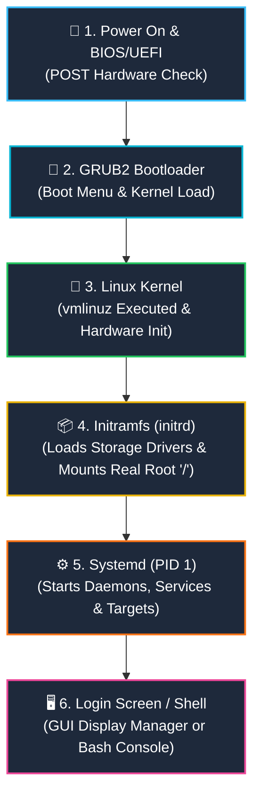

# 🚀 Linux Boot Process (පියවරෙන් පියවර සරල මගපෙන්වීම)

පරිගණකයක Power Button එක එබූ මොහොතේ සිට ඔබ ඉදිරියට Desktop එක හෝ Terminal Login Prompt එක පැමිණෙන තෙක් තිරය පිටුපස සිදුවන **Linux Booting Process** එක ඉතා සරලව, සැබෑ ජීවිතයේ උදාහරණ (Real-life Analogy) සමගින් පියවරෙන් පියවර මෙහි විස්තර කෙරේ.

---

## 🖼️ Linux Boot Process එකේ ප්‍රධාන පියවර 6 (Visual Flowchart)


> 💡 **රූපය පෙනෙන්නේ නැතිනම්:** IDE / VS Code එකේ ඉහළ දකුණු කෙළවරේ ඇති **"Open Preview"** icon එක ක්ලික් කරන්න (කෙටිමං යතුර: `Ctrl + Shift + V`). 
> නැතහොත් රූපය කෙලින්ම විවෘත කර බැලීමට [මෙතැන ක්ලික් කරන්න (Click to open image)](./linux_boot_process.jpg).

---

## 💡 සරල ජීවිත උදාහරණය (Real-Life Analogy)

Linux Boot Process එක හරියට **විශාල හෝටලයක් උදෑසන විවෘත කරනවා වගේ වැඩක්:**

1. **BIOS / UEFI:** මුරකරු පැමිණ හෝටලයේ ප්‍රධාන විදුලිය, ජල සැපයුම, දොර ජනෙල් හරියට තිබේදැයි පරික්ෂා කරයි (Hardware Check).
2. **GRUB Bootloader:** හෝටල් කළමනාකරු පැමිණ අද දිනයේ ක්‍රියාත්මක කළ යුත්තේ සාමාන්‍ය මෙනුවද (Normal Kernel) නැතහොත් හදිසි අලුත්වැඩියා මෙනුවද (Recovery Mode) කියා තෝරා ගනී.
3. **Kernel:** ප්‍රධාන විධායක නිලධාරියා (CEO) ඇතුළු වී මුළු හෝටලයේම අංශ පාලනය භාර ගනී.
4. **Initramfs:** ප්‍රධාන ගබඩා කාමරයේ යතුරු රැගෙන ගබඩාවේ දොර විවෘත කරගනී (Hard Disk Drivers load කිරීම).
5. **Systemd (PID 1):** ප්‍රධාන මැනේජර් පැමිණ කුස්සිය, AC, Lighting, Security කැමරා ආදී සියලුම සේවාවන් එකින් එක පණ ගන්වයි (Services Start).
6. **Login Screen:** හෝටලයේ ප්‍රධාන දොරටුව අමුත්තන් (Users) සඳහා විවෘත කර පිළිගැනීමේ කවුන්ටරය (Reception Desk) සූදානම් කරයි.

---

## 🔄 Booting Flowchart (ක්‍රියාකාරී සටහන)



---

## 📖 පියවර 6 සවිස්තරාත්මකව (Step-by-Step Explanation)

---

### පියවර 1: BIOS / UEFI (මූලික Hardware පරික්ෂාව)

* **සිදුවන දේ:** පරිගණකයේ Power button එක එබූ සැනින් Motherboard එකේ ඇති කුඩා chip එකක් (ROM) මඟින් BIOS හෝ නවීන UEFI ක්‍රියාත්මක වේ.
* **POST (Power-On Self-Test):** 
  * RAM එක, Processor එක, Keyboard එක, Hard Drive එක නිවැරදිව සම්බන්ධ වී ඇතිදැයි පරීක්ෂා කරයි.
  * යම් දෝෂයක් ඇත්නම් (උදා: RAM එකක් බුරුල් වී ඇත්නම්) Beep හඬක් නිකුත් කර නවතී.
* **Boot Device එක සෙවීම:**
  * BIOS සැකසුම් වල Boot Priority එක අනුව OS එක ඇති ධාවකය (Hard Disk, NVMe SSD, හෝ Bootable USB) සොයා ගනී.
* **ඊළඟ පියවරට භාරදීම:** එම ධාවකයේ මුල ඇති **Bootloader** එක සොයාගෙන එය RAM එකට load කර පාලනය ඊට භාර දෙයි.

---

### පියවර 2: GRUB2 Bootloader (OS තේරීමේ මෙනුව)

* **GRUB යනු කුමක්ද?:** **GR**and **U**nified **B**ootloader (දැනට බහුලව භාවිත වන්නේ GRUB 2 වේ).
* **පිහිටීම:** 
  * පැරණි MBR (Master Boot Record) ක්‍රමයේදී Disk එකේ පළමු 512 bytes තුළ.
  * නවීන UEFI ක්‍රමයේදී EFI System Partition එකේ (`/boot/efi/EFI/...`).
* **සිදුවන දේ:**
  * පරිගණකය On වන විට තිරයේ Linux OS එක තෝරා ගැනීමට තත්පර කිහිපයක countdown එකක් සහිත Menu එකක් දිස්වන්නේ මෙහිදීය.
  * Dual-boot (Windows + Ubuntu) දමා ඇත්නම් Windows ද Linux ද යන්න මෙහිදී තෝරාගත හැක.
  * පද්ධතියේ ප්‍රශ්නයක් ඇතිවුවහොත් **Recovery Mode** එකට යාමට අවස්ථාව ලැබේ.
* **ඊළඟ පියවරට භාරදීම:** ඔබ තේරූ Linux Kernel ගොනුව (`/boot/vmlinuz`) සහ Initial RAM Disk එක (`/boot/initrd.img`) RAM එකට load කර පාලනය Kernel එකට භාර දෙයි.

---

### පියවර 3: Kernel (Linux හි හදවත ක්‍රියාත්මක වීම)

* **Kernel යනු කුමක්ද?:** මෙහෙයුම් පද්ධතියේ ප්‍රධානතම මොළයයි (Core of the OS).
* **පිහිටීම:** `/boot/vmlinuz-<version>` (මෙහි `z` අකුරෙන් අදහස් වන්නේ මෙය Compressed file එකක් බවයි).
* **සිදුවන දේ:**
  * Kernel එක RAM එක තුළදී self-extract (විසුරුවා හැරීම) වේ.
  * Processor එක, Motherboard chipset, Memory Controllers සහ මූලික Drivers සක්‍රීය කරයි.
* **ගැටලුව:** Kernel එකට පරිගණකයේ සැබෑ Hard Drive එක කියවීමට අවශ්‍ය Drivers (SATA/NVMe/RAID controllers) තිබෙන්නේ Hard Disk එක තුළ ඇති `/lib/modules` තුළයි. නමුත් Hard Disk එක කියවීමට නොහැකිව එම drivers ගන්නේ කෙසේද?
* **විසඳුම:** මේ සඳහා Kernel එක 4 වන පියවර වන **Initramfs** උපකාර කර ගනී.

---

### පියවර 4: Initramfs / Initrd (තාවකාලික මූලික පද්ධතිය)

* **Initramfs යනු:** **Init**ial **RAM** **F**ile **S**ystem.
* **පිහිටීම:** `/boot/initrd.img-<version>`.
* **සිදුවන දේ:**
  * මෙය RAM එක තුළ හැදෙන කුඩා තාවකාලික Linux Root Directory (`/`) එකකි.
  * සැබෑ Hard Disk එක mount කිරීමට අවශ්‍ය storage controllers (LVM, Software RAID, Encryption, Ext4, XFS drivers) සියල්ල මෙහි සූදානම් කර ඇත.
  * එම drivers load කර, පරිගණකයේ සැබෑ Hard Drive එක හඳුනාගෙන, සැබෑ Root Filesystem (`/`) එක Read-Only ලෙස mount කරයි.
* **ඊළඟ පියවරට භාරදීම:** තාවකාලික filesystem එක ඉවත් කර, සැබෑ OS එකේ ප්‍රථම පරිශීලක process එක වන **Systemd (PID 1)** ක්‍රියාත්මක කර පාලනය ඊට පවරයි.

---

### පියවර 5: Systemd / Init (ප්‍රධාන පාලකයා - PID 1)

* **PID 1 යනු:** Process ID 1. Linux පද්ධතියේ ධාවනය වන අනෙකුත් සියලුම processes වල මව් process එක (Parent of all processes) මෙයයි.
* **නූතන පද්ධති වල:** Ubuntu, Debian, RedHat, CentOS, Fedora, Arch ආදී සියල්ලෙහිම දැන් default භාවිත වන්නේ **Systemd** වේ. (පැරණි Linux වල SysV Init භාවිත විය).
* **සිදුවන දේ:**
  * `/etc/fstab` ගොනුව කියවා ඉතිරි සියලුම Hard drive partitions mount කරයි.
  * පසුබිමේ ධාවනය වන සේවාවන් (Daemons/Services) සමාන්තරව (parallelly) වේගයෙන් පණ ගන්වයි:
    * Networking & Wi-Fi සේවාවන්
    * SSH Server (`sshd`)
    * Cron jobs (`cron`)
    * Firewall & Security policies
    * Sound, Bluetooth, Printing සේවාවන්
* **Systemd Targets:** 
  * `multi-user.target`: CLI (Terminal පමණක් ඇති Server පරිසරයක්).
  * `graphical.target`: GUI (Desktop Environment එක සහිත පරිසරයක්).

---

### පියවර 6: Runlevel / Target & Login Screen (පිළිගැනීමේ තිරය)

* **සිදුවන දේ:** පද්ධතිය සියලුම සේවාවන් ක්‍රියාත්මක කර අවසානයේ පරිශීලකයාට log වීමට සුදානම් වේ.
* **Desktop පරිගණකයක නම් (GUI):**
  * Display Manager එක (GDM - GNOME, LightDM, SDDM) මඟින් ලස්සන Graphical Login තිරයක් පෙන්වයි.
  * Username සහ Password ඇතුළත් කළ පසු GNOME, KDE, හෝ XFCE Desktop එක විවෘත වේ.
* **Server පරිගණකයක නම් (CLI):**
  * `getty` මඟින් Terminal Console එකේ Login Prompt එක පෙන්වයි:
    ```text
    Ubuntu 24.04 LTS server1 tty1
    server1 login: _
    ```
  * Password ලබා දී සාර්ථක වූ පසු ඔබේ Bash Shell එක (`$`) ක්‍රියාත්මක වේ.

---

## 🛠️ සැබෑ Linux Terminal එකකින් Boot Process එක පරීක්ෂා කරන්නේ කෙසේද?

ඔබේ Linux පරිගණකයේ Terminal එක විවෘත කර පහත commands මඟින් Booting තොරතුරු සජීවීව බලාගත හැක:

### 1. පද්ධතිය Boot වීමට කොපමණ කාලයක් ගතවූවාදැයි බැලීම:
```bash
systemd-analyze
```
* **ප්‍රතිදානය (Output):**
  ```text
  Startup finished in 3.421s (firmware) + 2.110s (loader) + 2.450s (kernel) + 4.120s (userspace) = 12.101s
  graphical.target reached after 4.100s in userspace
  ```

### 2. Boot වීමට වැඩිම කාලයක් ගත් Services ලැයිස්තුව:
```bash
systemd-analyze blame
```
*(මෙහිදී පද්ධතිය slow කරන services සොයාගත හැක)*

### 3. Kernel එක Boot වන විට සිදුවූ දේ බැලීම (Kernel Ring Buffer):
```bash
dmesg | less
```
හෝ boot වූ පණිවිඩ පමණක් පෙරීම:
```bash
dmesg | grep -i "memory"
dmesg | grep -i "root mount"
```

### 4. අංක 1 Process එක (PID 1) Systemd බව තහවුරු කරගැනීම:
```bash
ps -p 1 -o comm=
```
* **ප්‍රතිදානය:** `systemd`

### 5. පරිගණකයේ ඇති Kernel ගොනු සහ Initrd ගොනු බැලීම:
```bash
ls -lh /boot
```
*(මෙහිදී `vmlinuz` සහ `initrd.img` ගොනු දැකගත හැක)*

---

## 🧠 ඉක්මන් මතක් කිරීමේ වගුව (Quick Recap Table)

| පියවර | නම | භූමිකාව (Role) | සැබෑ ජීවිත සමානතාව |
| :---: | :--- | :--- | :--- |
| **1** | **BIOS / UEFI** | Hardware පරික්ෂාව (POST) සහ Boot device එක තේරීම | ආරක්ෂක මුරකරුවා විදුලිය සහ දොරවල් පරීක්ෂා කිරීම |
| **2** | **GRUB2** | OS එක තෝරා ගැනීමට Menu එක ලබා දීම සහ Kernel එක RAM එකට පැටවීම | හෝටල් මෙනුවෙන් අද ක්‍රියාත්මක කරන්නේ කුමක්දැයි තේරීම |
| **3** | **Kernel** | මෙහෙයුම් පද්ධතියේ හදවත. Hardware drivers init කිරීම | ආයතනයේ ප්‍රධාන විධායක නිලධාරියා (CEO) පැමිණීම |
| **4** | **Initramfs** | Storage drivers ලබාගෙන සැබෑ Root (`/`) partition එක mount කිරීම | ප්‍රධාන ගබඩා කාමරයේ ආරක්‍ෂිත යතුරු ලබා ගැනීම |
| **5** | **Systemd (PID 1)** | පසුබිමේ ඇති සියලුම Services සහ Daemons එකින් එක පණ ගැන්වීම | හෝටලයේ සියලුම අංශ (AC, Security, Light) ක්‍රියාත්මක කිරීම |
| **6** | **Login Screen** | පරිශීලකයාට Username & Password ලබා දී ඇතුළු වීමට ඉඩ දීම | පිළිගැනීමේ කවුන්ටරය (Reception) අමුත්තන්ට විවෘත කිරීම |

---

## 🔗 අදාළ වෙනත් මාර්ගෝපදේශ:
* 📁 [Linux File System Guide & Cheat Sheet](file:///d:/My/linux/README.md) – Linux ගොනු පද්ධතිය සහ Folders පිළිබඳ සම්පූර්ණ මගපෙන්වීම.
