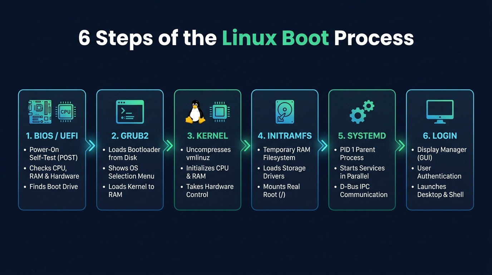
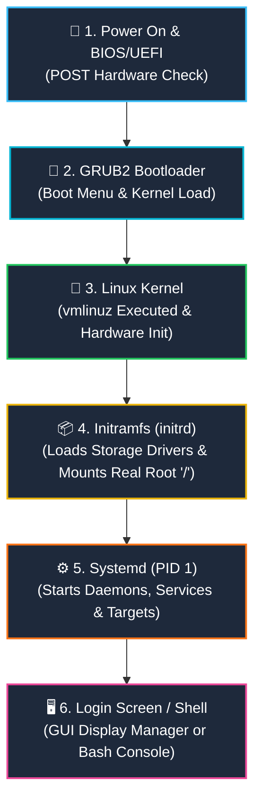
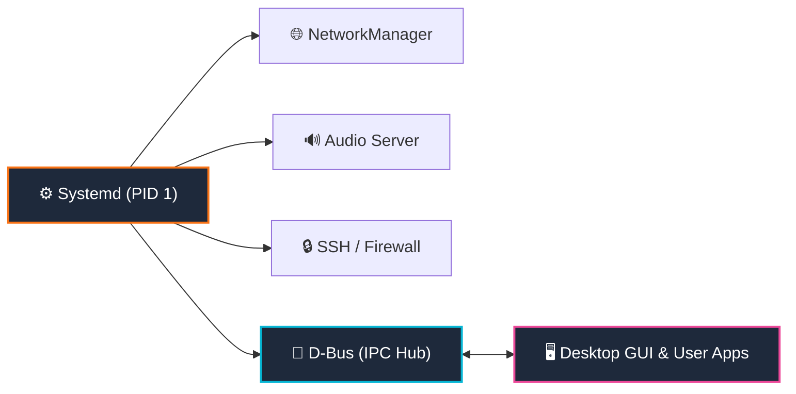

# 🚀 Linux Boot Process (පියවරෙන් පියවර සරල මගපෙන්වීම)

පරිගණකයක Power Button එක එබූ මොහොතේ සිට ඔබ ඉදිරියට Desktop එක හෝ Terminal Login Prompt එක පැමිණෙන තෙක් තිරය පිටුපස සිදුවන **Linux Booting Process** එක ඉතා සරලව, සැබෑ ජීවිතයේ උදාහරණ (Real-life Analogy) සමගින් පියවරෙන් පියවර මෙහි විස්තර කෙරේ.

> 📺 **වීඩියෝ ආශ්‍රය (YouTube Video Reference):**  
> මෙම පාඩම [▶️ Linux boot process Explained - Animated](https://youtu.be/lLg0dp9Pic8?si=k-yDi9NilKPHg1zX) වීඩියෝව පාදක කරගනිමින්, එහි විස්තර වන ප්‍රධාන සංකල්ප (Choreographed Relay Race, Parallel Systemd Units, D-Bus Communication Bus, සහ Bottleneck Critical Chain Analysis) පරිපූර්ණව ගළපා සකස් කර ඇත.

---

## 🖼️ Linux Boot Process එකේ ප්‍රධාන පියවර 6 (Visual Flowchart)



> 💡 **රූපය පෙනෙන්නේ නැතිනම්:** IDE / VS Code එකේ ඉහළ දකුණු කෙළවරේ ඇති **"Open Preview"** icon එක ක්ලික් කරන්න (කෙටිමං යතුර: `Ctrl + Shift + V`). 
> නැතහොත් රූපය කෙලින්ම විවෘත කර බැලීමට [මෙතැන ක්ලික් කරන්න (Click to open image)](./linux_boot_process.jpg).

### 📋 රූපයේ ඇති පියවර 6 හි නිශ්චිත ක්‍රියාකාරකම් (Step-by-Step Actions):

| පියවර (Card) | ප්‍රධාන කාර්යය (Core Duty) | එක් එක් පියවරේදී සිදුවන දේ (What Happens) |
| :---: | :--- | :--- |
| **1. BIOS / UEFI** | **Hardware POST Check** | • **Power-On Self-Test (POST):** CPU, RAM, Keyboard, GPU හරියට තියෙනවද පරික්ෂා කරයි.<br/>• **Hardware Initializing:** Motherboard bus සහ මූලික උපාංග හඳුනා ගනී.<br/>• **Finds Boot Drive:** Boot priority අනුව Hard Drive/NVMe හෝ USB සෙවීම. |
| **2. GRUB2** | **Bootloader & Menu** | • **Loads Bootloader from Disk:** Disk එකෙන් (MBR / EFI) Bootloader RAM එකට ගනී.<br/>• **Shows OS Selection Menu:** තිරයේ තත්පර ගණනක OS තේරීමේ මෙනුව පෙන්වයි.<br/>• **Loads Kernel to RAM:** ඔබ තෝරන Linux Kernel (`vmlinuz`) & `initrd` RAM එකට දමයි. |
| **3. KERNEL** | **OS Core & Hardware Init** | • **Uncompresses vmlinuz:** සම්පීඩිත Kernel ගොනුව RAM එක තුළ විසුරුවා හරියි.<br/>• **Initializes CPU & RAM:** CPU Cores, Memory Controllers සක්‍රීය කරයි.<br/>• **Takes Hardware Control:** උපාංග සියල්ලේම මූලික පාලනය තම අතට ගනී. |
| **4. INITRAMFS** | **Drivers & Mount Root** | • **Temporary RAM Filesystem:** RAM එක තුළ තාවකාලික root directory (`/`) එකක් හදයි.<br/>• **Loads Storage Drivers:** NVMe, SATA, LVM, RAID සහ Ext4/XFS drivers load කරයි.<br/>• **Mounts Real Root (/):** සැබෑ Hard Disk එක හඳුනාගෙන සැබෑ `/` partition එක Mount කරයි. |
| **5. SYSTEMD** | **PID 1 & Parallel Services** | • **PID 1 Parent Process:** OS එකේ මුල්ම user space process එක ලෙස ක්‍රියාත්මක වේ.<br/>• **Starts Services in Parallel:** Network, Wi-Fi, SSH, Audio, Daemons එකවර පණ ගන්වයි.<br/>• **D-Bus IPC Communication:** සේවාවන් අතර පණිවිඩ හුවමාරුවට D-Bus ක්‍රියාත්මක කරයි. |
| **6. LOGIN** | **Display Manager & Session** | • **Display Manager (GUI):** GDM/LightDM හරහා Graphical Login UI එක (හෝ TTY) දෙයි.<br/>• **User Authentication:** පරිශීලක නාමය සහ මුරපදය තහවුරු කරගනී.<br/>• **Launches Desktop & Shell:** `~/.bashrc` කියවා GNOME/KDE හෝ Bash Shell එක විවෘත කරයි. |

---

## 💡 සරල ජීවිත උපමා 2ක් (Real-Life Analogies)

### 🏃 1. "The Choreographed Relay Race" (බැටන් පොල්ල මාරු වන රිලේ තරඟය)
වීඩියෝවේ දක්වන පරිදි Linux Boot වීම යනු ඉතා සැලසුම් සහගත **රිලේ තරඟයක් (Choreographed Relay Race)** බඳුය. එක් ක්‍රීඩකයෙක් (Stage) තම වගකීම නිමවා, පද්ධතියේ පාලනය නමැති **"බැටන් පොල්ල" (Baton)** ඊළඟ ක්‍රීඩකයාට අතින් අත භාර දෙයි:
1. 🏃 **Runner 1 (BIOS / UEFI):** ධාවන පථය (Hardware) පරීක්ෂා කර සූදානම් කරයි ➔ **Baton එක GRUB වෙත.**
2. 🏃 **Runner 2 (GRUB Bootloader):** දුවන්නේ කිනම් ධාවන පථයේද (OS/Kernel) කියා තෝරා ගනී ➔ **Baton එක Kernel වෙත.**
3. 🏃 **Runner 3 (Kernel & Initramfs):** මොළය ක්‍රියාත්මක කර, Initramfs සහායකයා ලවා ගබඩාවේ (Hard Disk) දොර ඇරගනී ➔ **Baton එක Systemd (PID 1) වෙත.**
4. 🏃 **Runner 4 (Systemd - The Orchestrator):** සියලු පසුබිම් සේවාවන් (Network, Audio, Bluetooth) එකවර සමාන්තරව පණ ගන්වයි.
5. 📻 **The Walkie-Talkie (D-Bus):** සේවාවන් සහ Desktop එක එකිනෙකා සමඟ කතා කර ගැනීමට D-Bus නම් සංඥා පද්ධතිය ක්‍රියාත්මක කරයි.
6. 🏁 **The Finish Line (Login Screen & Desktop):** පරිශීලකයාට සුබ පතමින් Graphical Desktop එක හෝ Shell එක විවෘත කර තරඟය ජයග්‍රාහීව නිමා කරයි!

### 🏨 2. "The Hotel Opening" (හෝටලයක් විවෘත කිරීමේ උපමාව)
1. **BIOS / UEFI:** මුරකරු පැමිණ හෝටලයේ ප්‍රධාන විදුලිය, ජල සැපයුම, දොර ජනෙල් හරියට තිබේදැයි පරික්ෂා කරයි (Hardware Check).
2. **GRUB Bootloader:** හෝටල් කළමනාකරු පැමිණ අද දිනයේ ක්‍රියාත්මක කළ යුත්තේ සාමාන්‍ය මෙනුවද (Normal Kernel) නැතහොත් හදිසි අලුත්වැඩියා මෙනුවද (Recovery Mode) කියා තෝරා ගනී.
3. **Kernel:** ප්‍රධාන විධායක නිලධාරියා (CEO) ඇතුළු වී මුළු හෝටලයේම අංශ පාලනය භාර ගනී.
4. **Initramfs:** ප්‍රධාන ගබඩා කාමරයේ යතුරු රැගෙන ගබඩාවේ දොර විවෘත කරගනී (Hard Disk Drivers load කිරීම).
5. **Systemd (PID 1):** ප්‍රධාන මැනේජර් පැමිණ කුස්සිය, AC, Lighting, Security කැමරා ආදී සියලුම සේවාවන් එකවර පණ ගන්වයි (Services Start).
6. **Login Screen:** හෝටලයේ ප්‍රධාන දොරටුව අමුත්තන් (Users) සඳහා විවෘත කර පිළිගැනීමේ කවුන්ටරය (Reception Desk) සූදානම් කරයි.

---

## 🔄 Booting Flowchart (ක්‍රියාකාරී සටහන)



---

## 📖 පියවර 6 සවිස්තරාත්මකව (Step-by-Step Explanation)

---

### පියවර 1: BIOS / UEFI (මූලික Hardware පරික්ෂාව)

* **සිදුවන දේ:** පරිගණකයේ Power button එක එබූ සැනින් Motherboard එකේ ඇති කුඩා chip එකක් (ROM) මඟින් BIOS හෝ නවීන UEFI ක්‍රියාත්මක වේ.
* **POST (Power-On Self-Test):** 
  * RAM එක, Processor එක, Keyboard එක, Hard Drive එක නිවැරදිව සම්බන්ධ වී ඇතිදැයි පරීක්ෂා කරයි.
  * යම් දෝෂයක් ඇත්නම් (උදා: RAM එකක් බුරුල් වී ඇත්නම්) Beep හඬක් නිකුත් කර නවතී.
* **Boot Device එක සෙවීම:**
  * BIOS සැකසුම් වල Boot Priority එක අනුව OS එක ඇති ධාවකය (Hard Disk, NVMe SSD, හෝ Bootable USB) සොයා ගනී.
* **ඊළඟ පියවරට භාරදීම:** එම ධාවකයේ මුල ඇති **Bootloader** එක සොයාගෙන එය RAM එකට load කර පාලනය ඊට භාර දෙයි.

---

### පියවර 2: GRUB2 Bootloader (OS තේරීමේ මෙනුව)

* **GRUB යනු කුමක්ද?:** **GR**and **U**nified **B**ootloader (දැනට බහුලව භාවිත වන්නේ GRUB 2 වේ).
* **පිහිටීම:** 
  * පැරණි MBR (Master Boot Record) ක්‍රමයේදී Disk එකේ පළමු 512 bytes තුළ.
  * නවීන UEFI ක්‍රමයේදී EFI System Partition එකේ (`/boot/efi/EFI/...`).
* **සිදුවන දේ:**
  * පරිගණකය On වන විට තිරයේ Linux OS එක තෝරා ගැනීමට තත්පර කිහිපයක countdown එකක් සහිත Menu එකක් දිස්වන්නේ මෙහිදීය.
  * Dual-boot (Windows + Ubuntu) දමා ඇත්නම් Windows ද Linux ද යන්න මෙහිදී තෝරාගත හැක.
  * පද්ධතියේ ප්‍රශ්නයක් ඇතිවුවහොත් **Recovery Mode** එකට යාමට අවස්ථාව ලැබේ.
* **ඊළඟ පියවරට භාරදීම:** ඔබ තේරූ Linux Kernel ගොනුව (`/boot/vmlinuz`) සහ Initial RAM Disk එක (`/boot/initrd.img`) RAM එකට load කර පාලනය Kernel එකට භාර දෙයි.

---

### පියවර 3: Kernel (Linux හි හදවත ක්‍රියාත්මක වීම)

* **Kernel යනු කුමක්ද?:** මෙහෙයුම් පද්ධතියේ ප්‍රධානතම මොළයයි (Core of the OS).
* **පිහිටීම:** `/boot/vmlinuz-<version>` (මෙහි `z` අකුරෙන් අදහස් වන්නේ මෙය Compressed file එකක් බවයි).
* **සිදුවන දේ:**
  * Kernel එක RAM එක තුළදී self-extract (විසුරුවා හැරීම) වේ.
  * Processor එක, Motherboard chipset, Memory Controllers සහ මූලික Drivers සක්‍රීය කරයි.
* **ගැටලුව:** Kernel එකට පරිගණකයේ සැබෑ Hard Drive එක කියවීමට අවශ්‍ය Drivers (SATA/NVMe/RAID controllers) තිබෙන්නේ Hard Disk එක තුළ ඇති `/lib/modules` තුළයි. නමුත් Hard Disk එක කියවීමට නොහැකිව එම drivers ගන්නේ කෙසේද?
* **විසඳුම:** මේ සඳහා Kernel එක 4 වන පියවර වන **Initramfs** උපකාර කර ගනී.

---

### පියවර 4: Initramfs / Initrd (තාවකාලික මූලික පද්ධතිය)

* **Initramfs යනු:** **Init**ial **RAM** **F**ile **S**ystem.
* **පිහිටීම:** `/boot/initrd.img-<version>`.
* **සිදුවන දේ:**
  * මෙය RAM එක තුළ හැදෙන කුඩා තාවකාලික Linux Root Directory (`/`) එකකි.
  * සැබෑ Hard Disk එක mount කිරීමට අවශ්‍ය storage controllers (LVM, Software RAID, Encryption, Ext4, XFS drivers) සියල්ල මෙහි සූදානම් කර ඇත.
  * එම drivers load කර, පරිගණකයේ සැබෑ Hard Drive එක හඳුනාගෙන, සැබෑ Root Filesystem (`/`) එක Read-Only ලෙස mount කරයි.
* **ඊළඟ පියවරට භාරදීම:** තාවකාලික filesystem එක ඉවත් කර, සැබෑ OS එකේ ප්‍රථම පරිශීලක process එක වන **Systemd (PID 1)** ක්‍රියාත්මක කර පාලනය ඊට පවරයි.

---

### පියවර 5: Systemd / Init (ප්‍රධාන පාලකයා - PID 1 & Orchestrator)

* **PID 1 යනු:** Process ID 1. Linux පද්ධතියේ ධාවනය වන අනෙකුත් සියලුම processes වල මව් process එක (Parent of all processes) මෙයයි.
* **නූතන පද්ධති වල:** Ubuntu, Debian, RedHat, CentOS, Fedora, Arch ආදී සියල්ලෙහිම දැන් default භාවිත වන්නේ **Systemd** වේ.
* **⚡ Parallel Execution (වේගයේ රහස):**
  * පැරණි **SysV Init** ක්‍රමයේදී සේවාවන් පණ ගැන්වුණේ එකින් එක පිළිවෙලට (Serial/Sequential) බැවින් පරිගණකය boot වීමට මිනිත්තු කිහිපයක් ගත විය.
  * නමුත් **Systemd** මඟින් සේවාවන් අතර ඇති dependencies හඳුනාගෙන එකවර සේවාවන් රැසක් **සමාන්තරව (In Parallel)** පණ ගන්වයි. එම නිසා නූතන Linux තත්පර 3-5 කින් boot වේ!
* **Systemd Unit Files:** 
  * `.service`: පසුබිම් සේවා (උදා: `NetworkManager.service`, `bluetooth.service`, `sshd.service`).
  * `.target`: සේවා සමූහයක් එකට එකතු කරන ඉලක්ක (උදා: `graphical.target`, `multi-user.target`).
  * `.socket`, `.mount`, `.timer`: අවශ්‍ය විටෙක පමණක් සේවා පණ ගන්වන නවීන ක්‍රම.

#### 🚌 නොපෙනෙන සන්නිවේදකයා: D-Bus (Desktop Bus)
වීඩියෝවේ විශේෂයෙන් පැහැදිලි කරන අතිශය වැදගත් කොටසක් වන්නේ **D-Bus** ය:
* **D-Bus යනු කුමක්ද?:** **Inter-Process Communication (IPC)** පද්ධතියකි. පද්ධතියේ ධාවනය වන විවිධ සේවාවන් එකිනෙකා සමඟ කතාබහ කරන්නේ D-Bus හරහාය.
* **System Bus:** මුළු Operating System එකටම පොදු සංඥා හුවමාරු කරයි (උදා: Wi-Fi සම්බන්ධ වීම, Battery low වීම, Pen drive එකක් ඇතුළු කළ බව දැනුම් දීම).
* **Session Bus:** ඔබගේ Desktop එක සහ Apps අතර සන්නිවේදනය සලසයි (උදා: Spotify එකේ සිංදුවක් මාරු වන විට Desktop Notification එකක් පෙන්වීම).
* `systemctl` මඟින් Systemd වෙත විධානයන් ලබා දෙන්නේද D-Bus හරහාය.



---

### පියවර 6: User Space, Display Manager & Desktop Session (පිළිගැනීමේ තිරය)

* **සිදුවන දේ:** පද්ධතියේ සියලුම සේවාවන් සාර්ථකව පණ ගැන්වීමෙන් පසු පරිශීලකයා පිළිගැනීමට User Space එක සූදානම් කරයි.
* **Desktop පරිගණකයක නම් (GUI Target):**
  1. **Display Manager:** GDM (GNOME), LightDM, හෝ SDDM මඟින් ලස්සන Graphical Login තිරයක් පෙන්වයි.
  2. **Authentication:** Username සහ Password පරික්ෂා කර සාර්ථක වූ පසු User Session එක ආරම්භ වේ.
  3. **User Config Load වීම:** පරිශීලකයාගේ පරිසර සැකසුම් (`~/.profile`, `~/.bashrc`, environment variables) කියවයි.
  4. **Desktop Environment:** Wayland හෝ X11 මඟින් GNOME, KDE Plasma, හෝ XFCE ඩෙස්ක්ටොප් එක තිරය මත අඳියි.
* **Server පරිගණකයක නම් (CLI - Multi-User Target):**
  * `getty` මඟින් Terminal Console එකේ Login Prompt එක පෙන්වයි:
    ```text
    Ubuntu 24.04 LTS server1 tty1
    server1 login: _
    ```
  * Password ලබා දී සාර්ථක වූ පසු ඔබේ Bash Shell එක (`$`) ක්‍රියාත්මක වේ.

---

## 🛠️ සැබෑ Linux Terminal එකකින් Boot Process එක පරීක්ෂා කරන්නේ කෙසේද?

ඔබේ Linux පරිගණකයේ Terminal එක විවෘත කර පහත commands මඟින් Booting තොරතුරු සජීවීව බලාගත හැක:

### 1. පද්ධතිය Boot වීමට කොපමණ කාලයක් ගතවූවාදැයි බැලීම:
```bash
systemd-analyze
```
* **ප්‍රතිදානය (Output):**
  ```text
  Startup finished in 3.421s (firmware) + 2.110s (loader) + 2.450s (kernel) + 4.120s (userspace) = 12.101s
  graphical.target reached after 4.100s in userspace
  ```

### 2. Boot වීමට වැඩිම කාලයක් ගත් Services ලැයිස්තුව:
```bash
systemd-analyze blame
```
*(මෙහිදී පද්ධතිය slow කරන services සොයාගත හැක)*

### 3. ප්‍රමාදයන් ඇති කළ බැඳුණු සේවා දාමය සෙවීම (Critical Bottleneck Chain):
```bash
systemd-analyze critical-chain
```
* **වීඩියෝවේ පැහැදිලි කළ පරිදි:** එක් සේවාවක් පටන් ගැනීමට තවත් සේවාවක් නිමවන තෙක් බලා සිටීමට සිදුවන අවස්ථා ඇත (Dependency Chain). Boot වීම ප්‍රමාද කරන ප්‍රධානම bottleneck chain එක රතු පැහැයෙන් මෙහිදී සොයාගත හැක:
  ```text
  graphical.target @4.100s
  └─multi-user.target @4.098s
    └─docker.service @2.150s +1.200s
      └─network.target @2.140s
        └─NetworkManager.service @1.420s +720ms
  ```

### 4. Kernel එක Boot වන විට සිදුවූ දේ බැලීම (Kernel Ring Buffer):
```bash
dmesg | less
```
හෝ boot වූ පණිවිඩ පමණක් පෙරීම:
```bash
dmesg | grep -i "memory"
dmesg | grep -i "root mount"
```

### 5. අංක 1 Process එක (PID 1) Systemd බව තහවුරු කරගැනීම:
```bash
ps -p 1 -o comm=
```
* **ප්‍රතිදානය:** `systemd`

### 6. පරිගණකයේ ඇති Kernel ගොනු සහ Initrd ගොනු බැලීම:
```bash
ls -lh /boot
```
*(මෙහිදී `vmlinuz` සහ `initrd.img` ගොනු දැකගත හැක)*

---

## 🧠 ඉක්මන් මතක් කිරීමේ වගුව (Quick Recap Table)

| පියවර | නම | භූමිකාව (Role) | රිලේ තරඟයේ භූමිකාව (Relay Analogy) | හෝටල් උපමාව |
| :---: | :--- | :--- | :--- | :--- |
| **1** | **BIOS / UEFI** | Hardware පරික්ෂාව (POST) සහ Boot device එක තේරීම | **Runner 1:** ධාවන පථය (Hardware) පරීක්ෂා කර Baton එක දෙයි | ආරක්ෂක මුරකරුවා විදුලිය සහ දොරවල් පරීක්ෂා කිරීම |
| **2** | **GRUB2** | OS තේරීමේ Menu එක දී Kernel එක RAM එකට පැටවීම | **Runner 2:** දුවන OS ධාවන පථය තෝරා Baton එක දෙයි | මෙනුවෙන් අද ක්‍රියාත්මක කරන්නේ කුමක්දැයි තේරීම |
| **3** | **Kernel** | OS හි හදවත. Hardware drivers init කිරීම | **Runner 3:** මොළය ක්‍රියාත්මක වී කණ්ඩායම මෙහෙයවයි | ආයතනයේ ප්‍රධාන විධායක නිලධාරියා (CEO) පැමිණීම |
| **4** | **Initramfs** | Drivers ගෙන සැබෑ Root (`/`) partition එක mount කිරීම | **Helper:** ගබඩාවේ (Hard disk) යතුර ලබා දෙයි | ප්‍රධාන ගබඩා කාමරයේ ආරක්‍ෂිත යතුරු ලබා ගැනීම |
| **5** | **Systemd & D-Bus** | Services සමාන්තරව පණ ගැන්වීම සහ IPC සන්නිවේදනය | **Runner 4 & Radio:** සියලු සේවා එකවර දුවවා Walkie-Talkie සබඳතා හදයි | හෝටලයේ සියලු අංශ (AC, Light) එකවර ක්‍රියාත්මක කිරීම |
| **6** | **Login & Desktop** | Display Manager, Shell සහ User Session ඇරඹීම | **Finish Line:** පරිශීලකයාට සුබ පතමින් ජයග්‍රාහීව භාර දෙයි | පිළිගැනීමේ කවුන්ටරය (Reception) අමුත්තන්ට විවෘත කිරීම |

---

## 🔗 අදාළ වෙනත් මාර්ගෝපදේශ:
* 📁 [Linux File System Guide & Cheat Sheet](file:///d:/My/linux/README.md) – Linux ගොනු පද්ධතිය සහ Folders පිළිබඳ සම්පූර්ණ මගපෙන්වීම.
