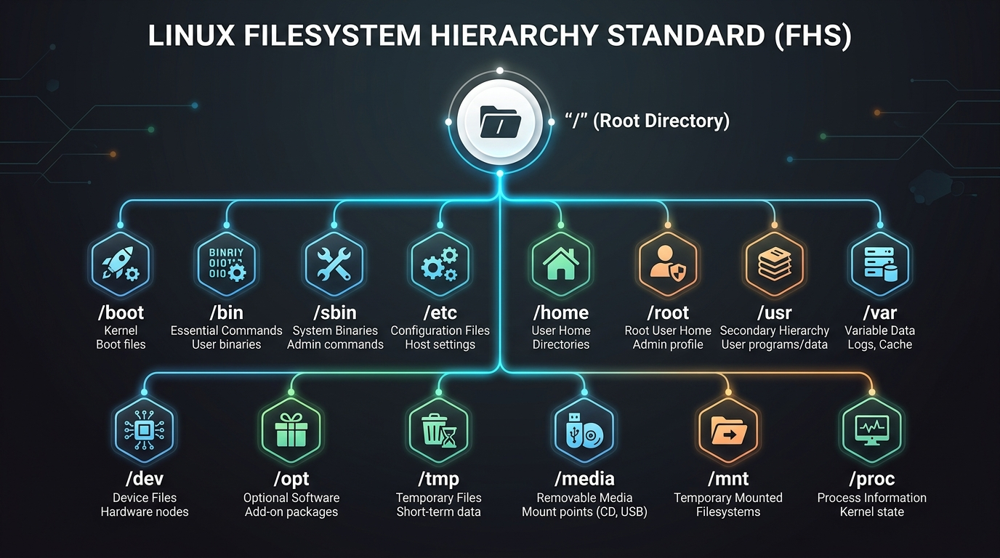

# 🐧 Linux File System Guide (සම්පූර්ණ මගපෙන්වීම)

මෙම ලේඛනය (Guide) මඟින් Linux File System එකේ මූලික සංකල්පවල සිට එහි අභ්යන්තර ව්යුහය (Hierarchy), ප්රධාන Folders සහ File Permissions දක්වා සරල සිංහලෙන් මෙන්ම තාක්ෂණික ගැඹුරින් (Deep Explanation) විස්තර කෙරේ.

---

## 1. මූලික සංකල්පය (Mindset Shift: Windows vs Linux)

| ලක්ෂණය | Windows | Linux |
| :--- | :--- | :--- |
| **ගබඩා ව්යුහය (Storage)** | Partitions සහ Drives පදනම් කරගත් ක්රමයකි (`C:\`, `D:\`, `E:\`). | තනි, උඩුයටිකුරු කළ ගසක් (Single Inverted Tree) වැනි ව්යුහයකි. |
| **ආරම්භක ලක්ෂ්යය** | ඒ ඒ Drive Letter එක (උදා: `C:\Users`). | **Root Directory** හෙවත් **`/`** (Forward Slash). |
| **ස්ලෑෂ් ලකුණ (Slash)** | Backslash (`\`) භාවිත වේ (උදා: `C:\Program Files`). | Forward slash (`/`) භාවිත වේ (උදා: `/usr/bin`). |
| **අමතර Disks / USB** | වෙනම අකුරක් ලැබේ (උදා: `E:\`, `F:\`). | පවතින ගසේ ෆෝල්ඩරයක් ඇතුළට **Mount** (සම්බන්ධ) වේ. |

---

## 2. "Everything is a File" (Linux හි මූලික දර්ශනය)

Linux පද්ධතියේ ඇති ප්රබලම සංකල්පය මෙයයි. Linux මෙහෙයුම් පද්ධතිය තුළ:
1. **Regular Files:** Text files, Images, Audio, PDF, Scripts ආදිය.
2. **Directories:** Folders පවා සලකන්නේ වෙනත් files ලැයිස්තුවක් අඩංගු විශේෂිත file එකක් ලෙසයි.
3. **Devices (Hardware):** Hard drives, USB, Keyboard, Mouse, Network Interfaces පවා `/dev` ෆෝල්ඩරය තුළ file එකක් ලෙස පවතී (උදා: `/dev/sda` යනු ප්රධාන hard drive එකයි).
4. **Kernel & Memory Data:** RAM එකේ තොරතුරු, CPU තොරතුරු, Running Processes පවා `/proc` ෆෝල්ඩරය තුළ file එකක් මෙන් කියවිය හැක (උදා: `/proc/cpuinfo`).

---

## 3. Linux File System Hierarchy (FHS)

Linux File System එක ආරම්භ වන්නේ මුදුනේ ඇති **Root (`/`)** මගිනි. අනෙක් සියලුම ෆෝල්ඩර් සහ උප-ෆෝල්ඩර් අතු බෙදී යන්නේ එයින් පහළටයි.



> 💡 **රූපය පෙනෙන්නේ නැතිනම්:** IDE / VS Code එකේ ඉහළ දකුණු කෙළවරේ ඇති **"Open Preview"** icon එක ක්ලික් කරන්න (කෙටිමං යතුර: `Ctrl + Shift + V`). 
> නැතහොත් රූපය කෙලින්ම විවෘත කර බැලීමට [මෙතැන ක්ලික් කරන්න (Click to open image)](./linux_filesystem_tree.jpg).

### 3.1. ගස් ව්යුහ සටහන (Directory Tree)

```mermaid
graph TD
    Root["/ (Root Directory)"]
    
    Root --> bin["/bin (User Binaries)"]
    Root --> sbin["/sbin (System Binaries)"]
    Root --> etc["/etc (Configurations)"]
    Root --> home["/home (User Personal Files)"]
    Root --> root["/root (Superuser Home)"]
    Root --> var["/var (Variable Data: Logs, Db)"]
    Root --> dev["/dev (Device Nodes)"]
    Root --> tmp["/tmp (Temporary Files)"]
    Root --> usr["/usr (Installed Software)"]
    Root --> opt["/opt (Optional 3rd-party Apps)"]
    Root --> media["/media (Auto-mounted Media)"]
    Root --> mnt["/mnt (Manual Mounts)"]
    Root --> proc["/proc (Virtual Kernel/Process Info)"]
    Root --> boot["/boot (Kernel & Bootloader)"]

    home --> user1["/home/username"]
    etc --> nginx["/etc/nginx"]
    var --> log["/var/log"]
```



---

## 4. ප්රධාන Directories ගැඹුරින් තේරුම් ගැනීම

### 📁 `/` (Root)
* මුළු පද්ධතියේම මූලික ආරම්භක ලක්ෂ්යයයි.
* අනෙක් සියලුම files, folders සහ partitions සම්බන්ධ වන්නේ මෙයට යටිනි.
* Root permissions නොමැතිව මෙහි කෙලින්ම වෙනස්කම් කළ නොහැක.

---

### 📁 `/home` (User Home Directories)
* සාමාන්ය Users ලාගේ personal files (Desktop, Documents, Downloads, Music) තැන්පත් වන තැනයි.
* Windows හි `C:\Users\` ට සමාන වේ.
* **උදාහරණ:** `janitha` නමැති user කෙනෙකුගේ home folder එක වන්නේ `/home/janitha` වේ. (Terminal එකේ කෙටි යෙදුම: `~`)

---

### 📁 `/root` (Superuser Home Directory)
* පද්ධතියේ ප්රධාන පරිපාලකයා (Administrator / Superuser / `root`) ගේ personal home directory එකයි.
* සාමාන්ය users ලාට `/home` යටතේ directory එකක් ලැබුණද, Administrator ට වෙනම `/root` ලැබෙන්නේ පද්ධතියේ ආරක්ෂාව සහ crash recovery සඳහාය.

---

### 📁 `/bin` (Essential User Binaries)
* සියලුම පරිශීලකයින්ට (All Users) run කළ හැකි මූලික Terminal Commands (Executables) මෙහි ඇත.
* Single-user mode වලදී පවා පද්ධතිය ක්රියාත්මක වීමට මේවා අත්යවශ්ය වේ.
* **උදාහරණ:** `ls`, `cd`, `cp`, `mv`, `rm`, `cat`, `mkdir`, `ping`.

---

### 📁 `/sbin` (System Binaries)
* System Administrator (`root`) ට පමණක් ධාවනය කළ හැකි, පද්ධතිය පාලනය කරන critical commands මෙහි ඇත.
* **උදාහරණ:** `reboot`, `shutdown`, `fdisk` (Hard drive partitions හැදීමට), `iptables` (Firewall), `ifconfig` / `ip`.

---

### 📁 `/etc` (Editable Text Configurations)
* පද්ධතියේ සහ ඔබ install කරන software වල **සියලුම Settings / Configuration files** මෙහි අඩංගු වේ.
* Windows වල Registry එක වෙනුවට Linux වල ඇත්තේ මේ `/etc` තුළ ඇති plain-text files වේ.
* **සැබෑ උදාහරණ:**
  * `/etc/passwd` – පද්ධතියේ ලියාපදිංචි සියලුම users ලාගේ ලැයිස්තුව.
  * `/etc/hosts` – Local DNS සහ IP mappings.
  * `/etc/nginx/nginx.conf` – Nginx Web Server configuration.
  * `/etc/ssh/sshd_config` – SSH Server settings.

---

### 📁 `/var` (Variable Data)
* පද්ධතිය ක්රියාත්මක වන විට **නිරන්තරයෙන් ප්රමාණය සහ අන්තර්ගතය වෙනස් වන දත්ත (Dynamic/Variable Data)** මෙහි තැන්පත් වේ.
* **සැබෑ උදාහරණ:**
  * `/var/log` – System සහ application logs (උදා: `/var/log/syslog`, `/var/log/auth.log`).
  * `/var/www/html` – Apache/Nginx web servers වල වෙබ් අඩවි files.
  * `/var/lib/mysql` හෝ `/var/lib/postgresql` – Database data files.

---

### 📁 `/tmp` (Temporary Files)
* Applications සහ OS එක මඟින් తాත්కాలිකව අවශ්ය වන files මෙහි තැන්පත් කරයි.
* බොහෝ Linux distributions වල System එක Restart (Reboot) වන විට මෙහි ඇති දත්ත ස්වයංක්රීයව මැකී යයි.

---

### 📁 `/dev` (Device Files)
* පරිගණකයේ ඇති සියලුම Hardware උපාංග (Disks, Terminals, USB) Linux විසින් හසුරුවන්නේ files විදිහටයි.
* **සැබෑ උදාහරණ:**
  * `/dev/sda` – පළමු Physical Hard Disk එක.
  * `/dev/sda1` – පළමු Hard Disk එකේ 1 වන Partition එක.
  * `/dev/null` – "Black hole" එකක් වැනි විශේෂ device file එකක්. මෙයට යවන ඕනෑම දත්තයක් විනාශ වේ (Discard වේ).

---

### 📁 `/proc` සහ `/sys` (Virtual Filesystems)
* මේවා Hard Disk එකේ සැබවින්ම save වී ඇති files නොවේ!
* පරිගණකය ක්රියාත්මක වන විට **RAM එක තුළ dynamically හැදෙන Virtual Filesystems** වේ.
* Kernel එක සහ Hardware අතර සන්නිවේදනය පිළිබඳ තොරතුරු බලාගත හැක.
* **උදාහරණ:**
  * `cat /proc/cpuinfo` – Processor එකේ විස්තර.
  * `cat /proc/meminfo` – RAM පරිභෝජනය.
  * `/proc/<PID>/` – දැනට run වන එක් එක් Process වල විස්තර (PID = Process ID).

---

### 📁 `/usr` (User System Resources)
* සාමාන්යයෙන් System එකට අමතරව install වන පරිශීලක මෘදුකාංග (User Applications, Libraries, Documentation) මෙහි තැන්පත් වේ.
* `/usr/bin` – පරිශීලකයා install කරන non-critical commands (උදා: `python`, `git`, `curl`, `node`).
* `/usr/lib` – එම programs වලට අවශ්ය shared libraries (`.so` files - Windows හි `.dll` වැනි).
* `/usr/local` – Administrator විසින් manual compile කර install කරන software.

---

### 📁 `/opt` (Optional Software Packages)
* තනි package එකක් ලෙස, dependencies සියල්ල එකම folder එකක තබා ගන්නා 3rd-party commercial හෝ standalone software මෙහි install වේ.
* **උදාහරණ:** Google Chrome, Discord, Slack, VS Code (`/opt/google/chrome`).

---

### 📁 `/media` සහ `/mnt` (Mount Points)
* **`/media`**: USB Flash drives, External Hard disks, CD/DVD plug කළ විට OS එක විසින් ස්වයංක්රීයව (automatically) mount කරන තැන.
* **`/mnt`**: System Administrator විසින් manually temporary filesystem එකක් (උදා: Network share, NFS drive) mount කරගන්නා තැන.

---

### 📁 `/boot` (Boot Loader Files)
* පරිගණකය Turn-on (Boot) වීමට අවශ්ය critical files මෙහි ඇත.
* Linux Kernel (`vmlinuz`), Initial RAM disk (`initrd`), සහ GRUB Bootloader configurations මෙහි පිහිටයි.

---

## 5. File Permissions & Ownership (RWX ගැඹුරින්)

Linux වල සෑම file එකකටම සහ folder එකකටම ආරක්ෂාව සඳහා **Permissions** සහ **Owner** කෙනෙකු සිටී.

Terminal එකේ `ls -l` command එක ලබා දුන් විට මෙසේ දිස්වේ:
```text
-rwxr-xr--  1  janitha  developers  4096  Sep 30 20:30  script.sh
```

### කොටස් විශ්ලේෂණය:
1. **File Type (1 වන අකුර):**
   * `-` : Regular file එකක්
   * `d` : Directory (Folder) එකක්
   * `l` : Symbolic Link (Shortcut) එකක්
2. **Permissions (ඉතිරි අකුරු 9):**
   * `r` = Read (කියවීමට)
   * `w` = Write (වෙනස් කිරීමට / මැකීමට)
   * `x` = Execute (Run කිරීමට - script/binary)

```text
    ┌─── File Type (- = file, d = directory)
    │
    │  ┌── User (Owner) Permissions: rwx (Read, Write, Execute)
    │  │   ┌── Group Permissions: r-x (Read, Execute)
    │  │   │   ┌── Others (World) Permissions: r-- (Read only)
    │  │   │   │
    - rwx r-x r--
```

### අංක ක්රමය (Octal Representation):
* `r = 4`, `w = 2`, `x = 1`
* `chmod 755 script.sh`
  * Owner: `4 + 2 + 1 = 7` (rwx)
  * Group: `4 + 0 + 1 = 5` (r-x)
  * Others: `4 + 0 + 1 = 5` (r-x)

---

## 6. Paths (මග) තේරුම් ගැනීම

* **Absolute Path (නිරපේක්ෂ මග):**
  * සැමවිටම root (`/`) එකෙන් ආරම්භ වේ.
  * උදාහරණ: `/home/janitha/projects/app.js`
* **Relative Path (සාපේක්ෂ මග):**
  * ඔබ දැනට සිටින තැන (Current Working Directory) පාදක කරගනී.
  * `.` = Current Directory
  * `..` = Parent Directory (පෙර ෆෝල්ඩරය)
  * උදාහරණ: `./app.js` හෝ `../config/db.json`

---

## 7. මූලික Linux Commands Cheat Sheet

```bash
# 1. Navigation (ෆෝල්ඩර් අතර ගමන් කිරීම)
pwd                      # දැනට සිටින සම්පූර්ණ path එක පෙන්වයි (Print Working Directory)
cd /home/janitha         # Absolute path එකට යෑම
cd ..                    # එක් පියවරක් පසුපසට යෑම
cd ~                     # Home directory එකට යෑම

# 2. Listing & Viewing (දත්ත බැලීම)
ls -la                   # සැඟවුණු (hidden) files සහ permissions සමග ලැයිස්තුගත කිරීම
cat /etc/hosts           # Text file එකක් terminal එකේ කියවීම
head -n 20 file.txt      # File එකක මුල් පේළි 20 බැලීම
tail -f /var/log/syslog  # Real-time logs බලාගැනීම

# 3. File Operations (Files හැසිරවීම)
mkdir new_folder         # අලුත් folder එකක් සෑදීම
touch file.txt           # අලුත් හිස් file එකක් සෑදීම
cp file.txt /tmp/        # File එකක් copy කිරීම
mv file.txt /home/       # File එකක් move කිරීම හෝ rename කිරීම
rm -rf folder_name       # Folder එකක් සහ එහි සියලුම දේ මැකීම (ප්රවේශමෙන් භාවිත කරන්න!)

# 4. System Information (පද්ධති විස්තර)
df -h                    # Hard disk space භාවිතය බැලීම (Disk Free)
du -sh *                 # Current folder එකේ ඇති files වල ප්රමාණය බැලීම
cat /proc/meminfo        # RAM පරිභෝජන විස්තර බැලීම
cat /proc/cpuinfo        # CPU විස්තර බැලීම
```
