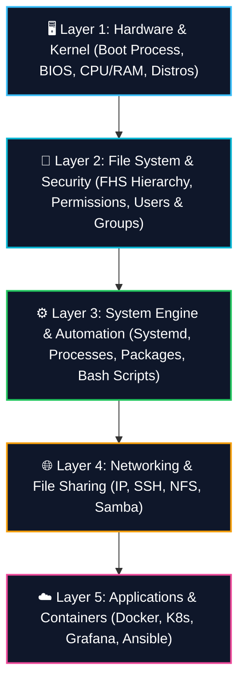
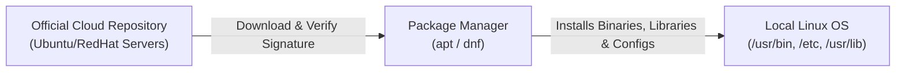
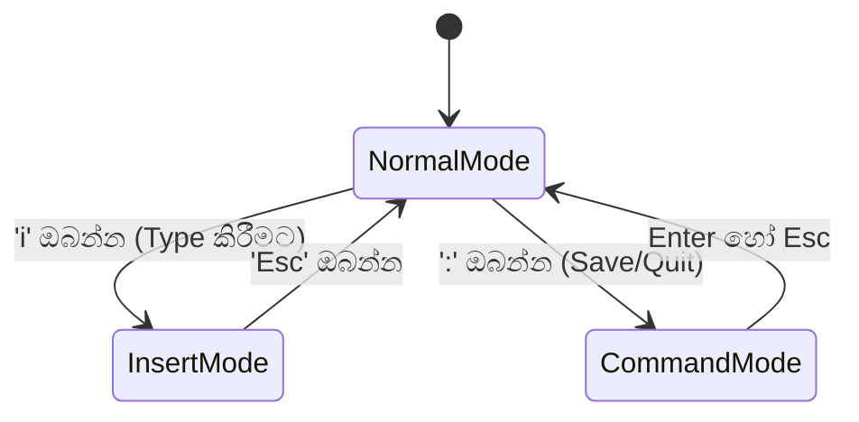
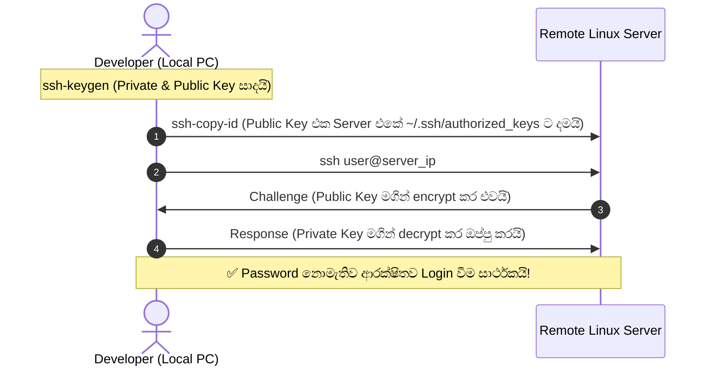
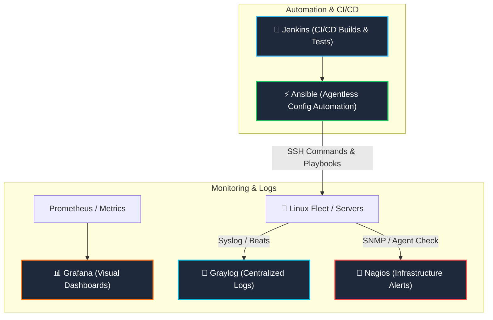
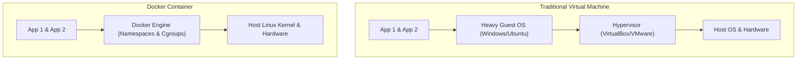
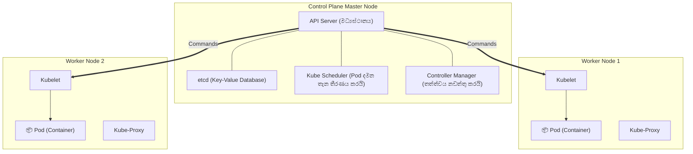

# 🐧 Master Linux Roadmap & Complete Course Guide (සම්පූර්ණ ප්‍රායෝගික Linux පාඨමාලාව)

> 💡 **මෙම සම්පූර්ණ මාර්ගෝපදේශය (Master Guide):**  
> Linux බිංදුවේ සිට System Administrator / DevOps Engineer මට්ටම දක්වා සරල සිංහලෙන්, සැබෑ ජීවිත උදාහරණ (Real-world Analogies), ප්‍රායෝගික Commands සහ මතක තබා ගැනීමේ පහසු Pattern එකක් ඔස්සේ පියවරෙන් පියවර මෙහි සම්පාදනය කර ඇත.

---

## 🧭 ඉක්මන් පටුන (Table of Contents)

* [🧠 Linux ඔළුවේ තබා ගැනීමේ ස්ථර 5 (The 5-Layer Mental Model)](#-linux-ඔළුවේ-තබා-ගැනීමේ-ස්ථර-5-the-5-layer-mental-model)
* [📅 MONTH 1: Introduction to Linux (මූලික පදනම)](#-month-1-introduction-to-linux-මූලික-පදනම)
  * [Week 1: Getting Started with Linux](#week-1-getting-started-with-linux)
  * [Week 2: Command Line Basics & File System Navigation](#week-2-command-line-basics--file-system-navigation)
  * [Week 3: Working with Files, Search & Permissions](#week-3-working-with-files-search--permissions)
  * [Week 4: User and Group Management](#week-4-user-and-group-management)
* [📅 MONTH 2: Intermediate Linux Skills (අතරමැදි කුසලතා)](#-month-2-intermediate-linux-skills-අතරමැදි-කුසලතා)
  * [Week 5: Package Management (apt / dnf / yum)](#week-5-package-management-apt--dnf--yum)
  * [Week 6: Text Editors (Nano & Vim Deep Dive)](#week-6-text-editors-nano--vim-deep-dive)
  * [Week 7: Processes & Services Management (Systemd)](#week-7-processes--services-management-systemd)
  * [Week 8: File System & Storage Management](#week-8-file-system--storage-management)
  * [Week 9: Shell Scripting & Bash Automation](#week-9-shell-scripting--bash-automation)
* [📅 MONTH 3: Advanced Linux Concepts (උසස් සංකල්ප සහ සේවා)](#-month-3-advanced-linux-concepts-උසස්-සංකල්ප-සහ-සේවා)
  * [Week 10: Linux Networking & Secure Remote Access (SSH)](#week-10-linux-networking--secure-remote-access-ssh)
  * [Week 11: Enterprise Open Source DevOps Tools](#week-11-enterprise-open-source-devops-tools)
  * [Week 12: Server Administration (NFS & Samba Sharing)](#week-12-server-administration-nfs--samba-sharing)
* [🐳 CONTAINERIZATION & CLOUD NATIVE (වලාකුළු තාක්ෂණය)](#-containerization--cloud-native-වලාකුළු-තාක්ෂණය)
  * [Docker: Containers, Images & Dockerfile](#docker-containers-images--dockerfile)
  * [Kubernetes (K8s): Architecture & Application Deployment](#kubernetes-k8s-architecture--application-deployment)
* [🎯 Ultimate Troubleshooting & Cheat Sheet (හදිසි ප්‍රශ්න විසඳීම)](#-ultimate-troubleshooting--cheat-sheet-හදිසි-ප්‍රශ්න-විසඳීම)

---

## 🧠 Linux ඔළුවේ තබා ගැනීමේ ස්ථර 5 (The 5-Layer Mental Model)

Linux ඉගෙන ගන්නා විට බොහෝ දෙනෙකුට Commands සිය ගණනක් අතරමං වේ. එසේ නොවීමට නම්, Linux යනු එක මත එක පිහිටි **ස්ථර 5ක (5 Layers) ගොඩනැගිල්ලක්** ලෙස සිතන්න:



* **Layer 1:** යකඩ කෑලි (Hardware) පණ ගන්වා Kernel එක වැඩ අරඹයි. *(Week 1, Boot)*
* **Layer 2:** ගොනු, ෆෝල්ඩර සහ පරිශීලකයින් ආරක්ෂිතව හසුරුවයි. *(Week 2, 3, 4)*
* **Layer 3:** මෘදුකාංග ස්ථාපනය කර, පසුබිම් සේවා පවත්වාගෙන ස්වයංක්‍රීය කරයි. *(Week 5, 6, 7, 8, 9)*
* **Layer 4:** වෙනත් පරිගණක සහ ජාල සමග කතා කරයි. *(Week 10, 12)*
* **Layer 5:** ව්‍යාපාරික මට්ටමේ Containerized Apps සහ Monitoring ධාවනය කරයි. *(Week 11, Docker, K8s)*

---

# 📅 MONTH 1: Introduction to Linux (මූලික පදනම)

---

## Week 1: Getting Started with Linux

### 1.1. Linux යනු කුමක්ද සහ එහි ඉතිහාසය (History of Linux)
* **1969 - UNIX:** Bell Labs හි Ken Thompson සහ Dennis Ritchie විසින් බහු-පරිශීලක (Multi-user) සහ ශක්තිමත් UNIX මෙහෙයුම් පද්ධතිය හැදුවද, එය මිල අධික වාණිජ නිෂ්පාදනයක් විය.
* **1983 - GNU Project:** Richard Stallman විසින් නිදහස් මෘදුකාංග (Free Software) ව්‍යාපාරය ආරම්භ කළ අතර, මෙවලම් (Compilers, Shell) හැදුවද OS එකේ "මොළය" (Kernel) හිස්ව තිබුණි.
* **1991 - Linux හි උපත:** ෆින්ලන්ත ජාතික **Linus Torvalds** විසින් ඔහුගේ විනෝදාංශයක් ලෙස නොමිලේ ඕනෑම කෙනෙකුට භාවිත කළ හැකි Linux Kernel එක නිර්මාණය කර අන්තර්ජාලයට මුදා හැරියේය. GNU මෙවලම් සහ Linux Kernel එක එකතු වීමෙන් අද අප භාවිත කරන සම්පූර්ණ **GNU/Linux** පද්ධතිය බිහි විය.

### 1.2. විවෘත මූලාශ්‍ර මෘදුකාංග (Open Source Software Basics)
* **Closed Source (Windows/macOS):** කේතය රහසිගතයි. පරිශීලකයාට එය වෙනස් කිරීමට හෝ ක්‍රියාත්මක වන අයුරු බැලීමට අවසර නැත.
* **Open Source (Linux):** Source Code එක ඕනෑම කෙනෙකුට පරික්ෂා කිරීමට, වෙනස් කිරීමට, සහ නොමිලේ බෙදා හැරීමට (GPL License) සම්පූර්ණ නිදහස ඇත.

### 1.3. Linux Distributions (Distros) වර්ගීකරණය
Linux Kernel එක වටා විවිධ පැකේජ සහ Desktop පරිසරයන් එකතු කර සාදන ලද පද්ධති **Distributions (Distros)** ලෙස හැඳින්වේ:

| පවුල (Distro Family) | ප්‍රධාන නියෝජිතයන් | විශේෂ ලක්ෂණය | භාවිතය (Use Case) |
| :--- | :--- | :--- | :--- |
| **Debian Family** | Ubuntu, Linux Mint, Debian | `apt` package manager, ඉතා ස්ථාවරයි, පහසුයි. | Beginners, Cloud Servers, Web Hosting |
| **Red Hat Family** | RHEL, Rocky Linux, AlmaLinux, Fedora | `dnf`/`yum` package manager, Enterprise මට්ටමේ ආරක්ෂාව. | Enterprise Banking, Corporate Servers |
| **Arch Family** | Arch Linux, Manjaro | Rolling release, අලුත්ම updates කෙලින්ම ලැබේ. | Advanced Users, Power Developers |

### 1.4. Linux ස්ථාපනය කරන්නේ කෙසේද? (Installation Options)
1. **WSL2 (Windows Subsystem for Linux):** Windows 10/11 පරිගණකයක තත්පර 2න් Terminal එකක් හරහා Ubuntu ධාවනය කිරීමට (පහසුම ක්‍රමය):
   ```powershell
   wsl --install
   ```
2. **Virtual Machine (VirtualBox / VMware):** Windows තුළම වෙනම කවුළුවක් තුළ සම්පූර්ණ Linux OS එකක් ධාවනය කිරීම.
3. **Dual Boot:** Hard disk එක partition කර Windows සහ Linux යන දෙකම පරිගණකයට දමා Power On කරන විට කැමති එක තෝරා ගැනීම.

> 🚀 **Boot වීම සිදුවන හැටි ගැඹුරින් දැනගැනීමට:** [Linux Boot Process සවිස්තරාත්මක මාර්ගෝපදේශය බලන්න](./LINUX_BOOT_PROCESS.md)

---

## Week 2: Command Line Basics & File System Navigation

### 2.1. මනස වෙනස් කරගැනීම (Mindset Shift: Windows vs Linux)

| ලක්ෂණය | Windows | Linux |
| :--- | :--- | :--- |
| **ගබඩා ව්‍යුහය** | Drives පදනම් වේ (`C:\`, `D:\`, `E:\`). | තනි, උඩුයටිකුරු කළ ගසක් වැනි ව්‍යුහයකි (Single Tree). |
| **ආරම්භක ලක්ෂ්‍යය** | Drive Letter එක (`C:\Users`). | **Root Directory** හෙවත් **`/`** (Forward Slash). |
| **ස්ලෑෂ් ලකුණ** | Backslash (`\`) භාවිත වේ. | Forward slash (`/`) භාවිත වේ (`/usr/bin`). |
| **"Everything is a File"** | Settings registry එකේ, hardware device manager එකේ. | Hardware, RAM, Processes සියල්ල file එකක් ලෙස කියවිය හැක. |

---

### 2.2. Linux File System Hierarchy (FHS)
Linux File System එක ආරම්භ වන්නේ මුදුනේ ඇති **Root (`/`)** මගිනි. අනෙක් සියලුම folders එයින් පහළට අතු බෙදී යයි:

```mermaid
graph TD
    Root["/ (Root Directory)"]
    Root --> bin["📁 /bin (User Commands: ls, bash, cp)"]
    Root --> sbin["📁 /sbin (Admin Commands: fdisk, reboot, ip)"]
    Root --> etc["📁 /etc (Configurations: passwd, hosts, nginx)"]
    Root --> home["📁 /home (User Personal Folders: /home/janitha)"]
    Root --> root["📁 /root (Superuser Personal Folder)"]
    Root --> var["📁 /var (Variable Data: logs, databases, cache)"]
    Root --> usr["📁 /usr (Installed Apps & Libraries: /usr/bin/python)"]
    Root --> dev["📁 /dev (Hardware Devices: /dev/sda, /dev/null)"]
    Root --> tmp["📁 /tmp (Temporary Files - Auto wiped on reboot)"]
    Root --> boot["📁 /boot (Kernel & GRUB files: vmlinuz)"]
    Root --> proc["📁 /proc (Virtual RAM/CPU Info: cpuinfo)"]
    Root --> mnt["📁 /mnt & /media (Mount Points for USB & Disks)"]
```




---

### 2.3. Paths (මග) තේරුම් ගැනීම
* **Absolute Path (නිරපේක්ෂ මග):** සැමවිටම root (`/`) එකෙන් පටන් ගනී. කොතැන සිටියත් එකම තැනට යයි.
  * උදාහරණ: `/home/janitha/projects/app.js`
* **Relative Path (සාපේක්ෂ මග):** ඔබ දැනට සිටින තැන (Current Directory) පාදක වේ.
  * `.` = Current Directory
  * `..` = Parent Directory (එක් ෆෝල්ඩරයක් පිටුපසට)
  * `~` = ඔබගේ Home Directory එක (`/home/<username>`)
  * `-` = ඔබ මීට පෙර සිටි Folder එක (Previous Directory)

---

### 2.4. මූලික Navigation & File Commands

```bash
# 1. පද්ධතියේ ඔබ සිටින තැන බැලීම (Print Working Directory)
pwd

# 2. ෆෝල්ඩර් අතර මාරු වීම (Change Directory)
cd /var/log          # Absolute path එකට යෑම
cd ..                # එක් ෆෝල්ඩරයක් පසුපසට යෑම
cd ~                 # කෙලින්ම ඔබේ Home directory එකට යෑම
cd -                 # කලින් හිටපු ෆෝල්ඩරයට ආපසු යෑම

# 3. ෆෝල්ඩරයක ඇති දේ ලැයිස්තුගත කිරීම (List)
ls                   # සාමාන්‍ය ලැයිස්තුව
ls -l                # Permissions, Owner, Size, Date සමග දීර්ඝ විස්තරයක් (Long format)
ls -la               # '.' වලින් පටන් ගන්නා සැඟවුණු (Hidden) files ද සහිතව බැලීම
ls -lh               # File size එක KB, MB වලින් කියවීමට පහසු ලෙස (Human-readable)

# 4. Folders සෑදීම සහ මැකීම
mkdir my_project              # තනි folder එකක් සෑදීම
mkdir -p dev/backend/api      # Parent folders ද සමග එකවර හදන්න (-p: parents)
rmdir empty_folder            # හිස් folder එකක් පමණක් මැකීම

# 5. Files සෑදීම, පිටපත් කිරීම සහ ගෙනයෑම
touch index.html              # අලුත් හිස් file එකක් සෑදීම
cp file.txt backup.txt        # File එකක් copy කිරීම
cp -r folder1/ folder_copy/   # Folder එකක් සහ එහි ඇතුළත සියල්ල copy කිරීම (-r: recursive)
mv old_name.txt new_name.txt  # File එකක් Rename කිරීම
mv file.txt /tmp/             # File එකක් වෙනත් තැනකට Move කිරීම

# 6. Files මැකීම (ප්‍රවේශමෙන්!)
rm file.txt                   # File එකක් මැකීම
rm -rf unwanted_dir/          # Folder එකක් සහ එහි සියලු ගොනු බලහත්කාරයෙන් මැකීම (-f: force)
```

---

## Week 3: Working with Files, Search & Permissions

### 3.1. Files වල අන්තර්ගතය බැලීම (Viewing Files)
* `cat filename.txt` : සම්පූර්ණ file එක එකපාරින්ම තිරයේ දිගහරියි (කුඩා files සඳහා සුදුසුයි).
* `less filename.txt` : විශාල files පිටුවෙන් පිටුව scroll කර කියවීමට (ඉවත්වීමට `q` ඔබන්න, සෙවීමට `/keyword` ඔබන්න).
* `head -n 10 file.txt` : File එකක මුල් පේළි 10 පමණක් බැලීම.
* `tail -n 10 file.txt` : File එකක අවසන් පේළි 10 පමණක් බැලීම.
* `tail -f /var/log/syslog` : සජීවීව update වන log files එක තිරය මත බලා සිටීමට (**DevOps සඳහා අතිශය වැදගත්!**).

---

### 3.2. Files තුළ සෙවීම (Grep & Find)

```bash
# 1. GREP: File එකක් තුළ ඇති වචනයක් හෝ රටාවක් සෙවීම
grep "error" /var/log/nginx/error.log       # "error" අඩංගු පේළි සෙවීම
grep -i "warning" app.log                   # Case-insensitive (කැපිටල්/සිම්පල් නොබලා) සෙවීම
grep -r "API_KEY" /home/janitha/projects/   # සියලු උප-ෆෝල්ඩර පීරා සෙවීම (-r: recursive)
grep -v "DEBUG" app.log                     # "DEBUG" නැති අනෙක් සියලු පේළි පෙන්වීම (Invert match)
grep -n "failed" /var/log/auth.log          # අදාළ පේළි අංකය (Line Number) සමග පෙන්වීම

# 2. FIND: මුළු Hard disk එකේම ඇති files සොයා ගැනීම
find /var/log -name "*.log"                 # .log වලින් අවසන් වන සියලු files සෙවීම
find /home -type d -name "backups"          # Directory (folder) පමණක් සෙවීම (-type d)
find /var -size +100M                       # 100MB ට වඩා විශාල files සෙවීම
find /tmp -mtime +7                         # දින 7කට වඩා පැරණි files සෙවීම
```

---

### 3.3. File Permissions & Ownership (RWX ගැඹුරින්)

Linux වල සෑම file එකකටම සහ folder එකකටම ආරක්ෂාව සඳහා **Permissions** සහ **Owner** කෙනෙකු සිටී.

Terminal එකේ `ls -l` දුන් විට:
```text
-rwxr-xr--  1  janitha  developers  4096  Oct 01 10:30  deploy.sh
```

```text
    ┌─── File Type (- = file, d = directory, l = link)
    │
    │  ┌── User / Owner Permissions (rwx)
    │  │   ┌── Group Permissions (r-x)
    │  │   │   ┌── Others / World Permissions (r--)
    │  │   │   │
    - rwx r-x r--
```

* `r` (Read = 4) : ගොනුව කියවීමට ඇති හැකියාව.
* `w` (Write = 2) : ගොනුව වෙනස් කිරීමට හෝ මැකීමට ඇති හැකියාව.
* `x` (Execute = 1) : Script හෝ Application එකක් ලෙස Run කිරීමට ඇති හැකියාව.

#### අංක ක්‍රමය (Octal Calculation):
* `7` = `4 + 2 + 1` = `rwx` (සම්පූර්ණ පාලනය)
* `6` = `4 + 2 + 0` = `rw-` (කියවීමට සහ ලිවීමට)
* `5` = `4 + 0 + 1` = `r-x` (කියවීමට සහ Run කිරීමට)
* `4` = `4 + 0 + 0` = `r--` (කියවීමට පමණි)

```bash
# Permissions වෙනස් කිරීම (chmod)
chmod 755 deploy.sh           # Owner=rwx (7), Group=r-x (5), Others=r-x (5)
chmod 600 id_rsa              # Private SSH key: Ownerට පමණක් කියවීමට/ලිවීමට (rw-------)
chmod +x script.sh            # Execute permission එක එකතු කිරීම

# අයිතිකරු වෙනස් කිරීම (chown)
chown janitha deploy.sh                  # Owner janitha බවට පත් කිරීම
chown janitha:developers deploy.sh       # Owner සහ Group දෙකම එකවර වෙනස් කිරීම
chown -R www-data:www-data /var/www/html # Web folder එකේ සියලු දේටම බලපාන පරිදි (-R: recursive)
```

---

## Week 4: User and Group Management

### 4.1. පරිශීලක වර්ග (User Types)
1. **Root (Superuser):** පද්ධතියේ සර්වබලධාරී පරිපාලකයා (UID 0). ඕනෑම file එකක් මැකීමට හෝ වෙනස් කිරීමට හැකියාව ඇත.
2. **System Users:** පසුබිම් සේවා (Apache, MySQL, SSH) ධාවනය වන පරිශීලකයින් (UID 1-999). මොවුන්ට Login Shell එකක් නොමැත (`/usr/sbin/nologin`).
3. **Regular Users:** සැබෑ මිනිසුන් වන අප භාවිත කරන Accounts (UID 1000+).

### 4.2. අත්‍යවශ්‍ය Configuration Files
* `/etc/passwd` : පද්ධතියේ සියලු පරිශීලකයින්ගේ ලැයිස්තුව (Username, UID, GID, Home dir, Shell).
* `/etc/shadow` : පරිශීලකයින්ගේ Encrypted Password ගබඩා වන අතිශය රහසිගත ගොනුව.
* `/etc/group` : සියලුම Groups සහ ඒවායේ සාමාජිකයින්.
* `/etc/sudoers` : පරිපාලක (Root) බලතල භාවිත කළ හැකි පරිශීලකයින්ගේ නීති මාලාව.

### 4.3. User & Group Commands

```bash
# 1. පරිශීලකයෙකු සෑදීම
sudo useradd -m -s /bin/bash kamal   # Home directory එකක් (-m) සහ bash shell එකක් (-s) සහිතව kamal සෑදීම
sudo passwd kamal                   # kamal ට password එකක් ලබා දීම

# 2. පරිශීලකයා Group එකකට දැමීම
sudo groupadd devops                # අලුත් Group එකක් සෑදීම
sudo usermod -aG devops kamal       # kamal ව devops group එකට එකතු කිරීම (-aG: append to group)
sudo usermod -aG sudo kamal         # kamal ට root powers (sudo privileges) ලබා දීම

# 3. තොරතුරු බැලීම
id kamal                            # kamal ගේ UID, GID සහ Groups බැලීම
groups kamal                        # සාමාජිකත්වය දරන Groups බැලීම
whoami                              # ඔබ දැනට ලොග් වී සිටින username එක බැලීම

# 4. පරිශීලකයෙකු මැකීම
sudo userdel -r kamal               # Home folder එකත් සමගම මැකීම (-r)
```

---

# 📅 MONTH 2: Intermediate Linux Skills (අතරමැදි කුසලතා)

---

## Week 5: Package Management (apt / dnf / yum)

Linux වල මෘදුකාංග ස්ථාපනය කරන්නේ Windows මෙන් setup.exe download කර Next Next එබීමෙන් නොවේ. Linux වල නිල **Repositories (Software App Stores)** පවතී.



### Ubuntu/Debian (`apt`) vs RHEL/CentOS (`dnf`/`yum`):

```bash
# === 1. Ubuntu / Debian Family (APT) ===
sudo apt update                  # Repository එකේ නවතම package ලැයිස්තුව update කරගැනීම
sudo apt upgrade -y              # පරිගණකයේ ඇති පැරණි මෘදුකාංග අලුත්ම සංස්කරණයට upgrade කිරීම
sudo apt install -y nginx        # Nginx web server එක install කිරීම
sudo apt remove nginx            # App එක ඉවත් කළද config files ඉතිරි කරයි
sudo apt purge nginx             # App එක සමග සියලු config files මුළුමනින්ම මකා දමයි
sudo apt autoremove -y           # තවදුරටත් අවශ්‍ය නොවන dependencies පිරිසිදු කිරීම

# === 2. Red Hat / CentOS / Fedora (DNF / YUM) ===
sudo dnf check-update            # Updates පරීක්ෂා කිරීම
sudo dnf install -y httpd        # Apache web server install කිරීම
sudo dnf update -y               # සියල්ල update කිරීම
sudo dnf remove httpd            # ඉවත් කිරීම

# === 3. Standalone .deb සහ .rpm Install කිරීම ===
sudo dpkg -i package.deb         # Local .deb file එකක් install කිරීම
sudo rpm -ivh package.rpm        # Local .rpm file එකක් install කිරීම
```

---

## Week 6: Text Editors (Nano & Vim Deep Dive)

Linux Servers වල Graphical UI එකක් නැති බැවින්, Terminal එක තුළම Text Files සහ Configuration වෙනස් කිරීමට Text Editors භාවිත වේ.

### 6.1. Nano (ආධුනිකයින්ට පහසුම Editor එක)
* විවෘත කිරීම: `nano /etc/nginx/nginx.conf`
* **ප්‍රධාන කෙටිමං:**
  * `Ctrl + O` : Save (WriteOut) කිරීම.
  * `Ctrl + X` : Editor එකෙන් Exit වීම.
  * `Ctrl + W` : වචනයක් Search කිරීම.

---

### 6.2. Vim (DevOps / SysAdmin වරුන්ගේ බලවත්ම මෙවලම)
Vim ක්‍රියා කරන්නේ **Modes (මාතයන්)** 3ක් ඔස්සේය:



| Mode | විස්තරය | යතුර |
| :--- | :--- | :--- |
| **Normal Mode** | පෙරනිමි (Default) මාතයයි. මෙහිදී ලියන්න බැහැ, Navigation සහ Copy/Paste කරන්නේ මෙහිදීය. | `Esc` |
| **Insert Mode** | Text ලිවීමට (Type කිරීමට) හැකි මාතය. | `i` |
| **Command Mode** | ගොනුව Save කිරීමට, පිටවීමට සහ Search කිරීමට. | `:` |

#### 🔑 අත්‍යවශ්‍ය Vim Shortcuts Cheat Sheet:
* **ගමනාගමනය (Normal Mode):**
  * `h` = වමට, `l` = දකුණට, `k` = ඉහළට, `j` = පහළට
  * `0` = පේළියේ මුලට, `$` = පේළියේ අගට
  * `gg` = File එකේ පළමු පේළියට, `G` = File එකේ අවසන් පේළියට
* **සංස්කරණය (Normal Mode):**
  * `dd` = සම්පූර්ණ පේළියක් Delete (Cut) කිරීම
  * `yy` = සම්පූර්ණ පේළියක් Copy (Yank) කිරීම
  * `p` = Copy කළ දේ Paste කිරීම
  * `u` = Undo (සිදු කළ වෙනසක් අවලංගු කිරීම)
* **Command Mode (`:` එබීමෙන් පසු):**
  * `:w` = Save (Write) කිරීම
  * `:q` = පිටවීම (Quit)
  * `:wq` හෝ `:x` = Save කර පිටවීම
  * `:q!` = සිදු කළ වෙනස්කම් නොසුරකා බලහත්කාරයෙන් පිටවීම
  * `/search_word` = File එක තුළ වචනයක් Search කිරීම

---

## Week 7: Processes & Services Management (Systemd)

### 7.1. Process එකක් යනු කුමක්ද?
පරිගණකයේ ධාවනය වන ඕනෑම වැඩසටහනක් **Process** එකකි. සෑම process එකකටම අනන්‍ය **PID (Process ID)** අංකයක් හිමි වේ.
* **Foreground Process:** Terminal එක අල්ලාගෙන ක්‍රියාත්මක වන වැඩසටහන්.
* **Background Process / Daemon:** තිරය පිටුපස නිහඬව ධාවනය වන සේවාවන්.

### 7.2. Processes නිරීක්ෂණය සහ පාලනය

```bash
# 1. ධාවනය වන සියලුම Processes බැලීම
ps aux                           # System එකේ ධාවනය වන සියලු processes විස්තරාත්මකව බැලීම
ps aux | grep nginx              # nginx process එකේ PID එක සෙවීම

# 2. Dynamic Real-time Task Manager (CPU & RAM බැලීම)
top                              # පෙරනිමි task manager එක (ඉවත්වීමට 'q')
htop                             # වඩාත් අලංකාර, වර්ණවත් task manager එක (sudo apt install htop)

# 3. කරදරකාරී Processes නැවැත්වීම (Kill)
kill 1425                        # PID 1425 ට සාමකාමීව නවතින ලෙස SIGTERM (15) යැවීම
kill -9 1425                     # Process එක ප්‍රතිචාර නොදක්වන්නේ නම් බලහත්කාරයෙන් නැවැත්වීම (SIGKILL)
pkill -f python                  # නම අනුව සියලුම python processes kill කිරීම
killall nginx                    # nginx නමින් ඇති සියලු instances නැවැත්වීම

# 4. Process එකක් Background එකට යැවීම
python3 long_task.py &           # අගට '&' දැමූ විට background එකේ දුවයි
nohup ./script.sh > out.log 2>&1 & # Terminal එක වැසුවද නොනැවතී දුවන පරිදි පණ ගැන්වීම
```

---

### 7.3. Systemd Services පාලනය (systemctl)
නූතන Linux පද්ධති වල සේවාවන් පාලනය කරන්නේ **Systemd** මගිනි:

```bash
sudo systemctl status nginx      # Service එකේ තත්ත්වය (Running ද Dead ද) බැලීම
sudo systemctl start nginx       # Service එක On කිරීම
sudo systemctl stop nginx        # Service එක Off කිරීම
sudo systemctl restart nginx     # Service එක Restart කිරීම
sudo systemctl reload nginx      # Configuration වෙනස් කළ විට downtime එකක් නැතිව reload කිරීම
sudo systemctl enable nginx      # පරිගණකය Boot වන විටම auto start වන ලෙස සැකසීම
sudo systemctl disable nginx     # Boot වන විට auto start වීම වැළැක්වීම

# Service Logs බැලීම (journalctl)
journalctl -u nginx.service -f   # Nginx service එකේ logs සජීවීව බැලීම
```

---

## Week 8: File System & Storage Management

### 8.1. Storage උපාංග හඳුනා ගැනීම
* `/dev/sda` : පළමු SATA/SCSI Hard Disk එක (`sda1`, `sda2` යනු එහි partitions වේ).
* `/dev/nvme0n1` : නවීන අතිවේගී NVMe SSD එකක් (`nvme0n1p1` යනු partition 1 වේ).

### 8.2. Storage Commands & Partitioning

```bash
# 1. තැටි තොරතුරු බැලීම
lsblk                            # Disks සහ Partitions ගසක් ආකාරයෙන් පෙන්වීම
sudo fdisk -l                    # සියලුම partitions වල සම්පූර්ණ විස්තර බැලීම
df -h                            # එක් එක් partition වල ඉතිරිව ඇති ඉඩ ප්‍රමාණය (Disk Free) බැලීම
du -sh /var/log/                 # අදාළ folder එක ගෙන ඇති සම්පූර්ණ ඉඩ ප්‍රමාණය බැලීම

# 2. Hard Disk එකක් Partition කර Mount කිරීම (Step-by-step)
sudo fdisk /dev/sdb              # අලුත් Hard disk එකක් partition කිරීම (n: new, w: write)
sudo mkfs.ext4 /dev/sdb1         # සෑදූ partition එක ext4 filesystem එකක් ලෙස format කිරීම
sudo mkdir /mnt/data             # Mount point folder එක සෑදීම
sudo mount /dev/sdb1 /mnt/data   # Disk එක folder එකට සම්බන්ධ (Mount) කිරීම
sudo umount /mnt/data            # ආරක්ෂිතව Unmount කිරීම

# 3. Permanent Mount සැකසීම (/etc/fstab)
# පරිගණකය Restart වූ විටද ස්වයංක්‍රීයව mount වීමට /etc/fstab ගොනුවට එක් කරන්න:
# UUID=xxxx-xxxx  /mnt/data  ext4  defaults  0  2
```

---

## Week 9: Shell Scripting & Bash Automation

SysAdmin සහ DevOps ඉංජිනේරුවෙකුගේ ප්‍රධානතම අවිය වන්නේ **Bash Scripting** මඟින් දෛනික කාර්යයන් ස්වයංක්‍රීය (Automate) කිරීමයි.

### 9.1. මුල්ම Bash Script එක
ගොනුවක් සාදන්න: `nano backup.sh`

```bash
#!/bin/bash
# Shebang (#!/bin/bash) මගින් පද්ධතියට පවසන්නේ මෙය Bash මගින් ධාවනය කළ යුතු බවයි.

echo "=== System Backup Automation Script ==="

# 1. Variables (විචල්‍යයන්)
BACKUP_SRC="/home/janitha/documents"
BACKUP_DEST="/mnt/backups"
TIMESTAMP=$(date +"%Y-%m-%d_%H-%M-%S")
ARCHIVE_NAME="backup_$TIMESTAMP.tar.gz"

# 2. If-Else Condition (Backup folder එක තිබේදැයි බැලීම)
if [ ! -d "$BACKUP_DEST" ]; then
    echo "Directory $BACKUP_DEST does not exist. Creating now..."
    mkdir -p "$BACKUP_DEST"
fi

# 3. Backup ක්‍රියාවලිය
echo "Archiving files from $BACKUP_SRC..."
tar -czf "$BACKUP_DEST/$ARCHIVE_NAME" "$BACKUP_SRC" 2>/dev/null

# 4. Checking Exit Code ($? = 0 නම් සාර්ථකයි)
if [ $? -eq 0 ]; then
    echo "✅ Backup successfully created at: $BACKUP_DEST/$ARCHIVE_NAME"
else
    echo "❌ Backup failed!"
    exit 1
fi

# 5. Loops (පැරණි දින 7ට වඩා පැරණි backups මැකීම)
echo "Cleaning up backups older than 7 days..."
for old_file in $(find "$BACKUP_DEST" -name "backup_*.tar.gz" -mtime +7); do
    echo "Deleting old backup: $old_file"
    rm -f "$old_file"
done

echo "=== Backup Process Completed! ==="
```

#### Script එක ධාවනය කිරීම:
```bash
chmod +x backup.sh     # Execute permission ලබා දීම
./backup.sh            # Script එක Run කිරීම
```

---

# 📅 MONTH 3: Advanced Linux Concepts (උසස් සංකල්ප සහ සේවා)

---

## Week 10: Linux Networking & Secure Remote Access (SSH)

### 10.1. Network Commands & Troubleshooting

```bash
# 1. IP ලිපින සහ Interfaces බැලීම
ip a                             # සියලුම network cards සහ IP addresses බැලීම
ip route                         # Default Gateway එක (Router IP) බැලීම

# 2. සම්බන්ධතාවය පරික්ෂා කිරීම
ping -c 4 8.8.8.8                # Google DNS වෙත පැකට් 4ක් යවා සම්බන්ධතාව බැලීම
traceroute google.com            # අදාළ Server එකට පැකට් ගමන් කරන මාර්ගය බැලීම
dig google.com                   # DNS හරහා Domain එකේ IP එක විසඳෙන අයුරු බැලීම
curl -I https://www.google.com   # Web server එකේ HTTP Response Headers බැලීම

# 3. Ports සහ Listening Services බැලීම
ss -tulpn                        # පද්ධතියේ විවෘතව ඇති (Listening) සියලු Ports සහ ඒවාට අදාළ Programs බැලීම
# -t: TCP, -u: UDP, -l: Listening, -p: Process name, -n: Numeric port

# 4. Firewall කළමනාකරණය (UFW)
sudo ufw status                  # Firewall තත්ත්වය බැලීම
sudo ufw allow 22/tcp            # SSH port එක විවෘත කිරීම
sudo ufw allow 80/tcp            # HTTP web port එක විවෘත කිරීම
sudo ufw enable                  # Firewall On කිරීම
```

---

### 10.2. SSH (Secure Shell) සහ Passwordless Login
දුරස්ථ Linux Server එකකට ලොග් වීමේ ප්‍රමිතිය **SSH** වේ.



```bash
# 1. Server එකට Log වීම
ssh janitha@192.168.1.100

# 2. Password නොමැතිව Key මඟින් ආරක්ෂිතව Login වීම (DevOps Best Practice):
ssh-keygen -t ed25519                 # ඔබේ පරිගණකයේ අතිශය ආරක්ෂිත Key Pair එකක් හැදීම
ssh-copy-id janitha@192.168.1.100    # Public key එක Server එකට යැවීම
ssh janitha@192.168.1.100            # දැන් Password ඉල්ලන්නේ නැතිව Login වේ!

# 3. Files ආරක්ෂිතව Copy කිරීම (SCP & Rsync)
scp app.zip janitha@192.168.1.100:/tmp/       # Local සිට Server එකට file එකක් යැවීම
rsync -avz /local/dir/ janitha@remote:/data/   # වෙනස් වූ files පමණක් වේගයෙන් Sync කිරීම
```

---

## Week 11: Enterprise Open Source DevOps Tools

වර්තමාන Enterprise ආයතනයක Linux Servers සිය ගණනක් කළමනාකරණය කිරීම සඳහා පහත දැක්වෙන ප්‍රධාන Open Source මෙවලම් භාවිත වේ:



### මෙවලම් 5 හි සාරාංශය:
1. **📊 Grafana:** CPU, RAM, Network bandwidth, සහ Application metrics කාලානුරූපව අලංකාර Interactive Dashboards මඟින් visual කර පෙන්වයි.
2. **🚨 Nagios:** Server එකක් Down වුවහොත්, Disk space 90% පිරුණහොත් හෝ Service එකක් ක්‍රියාවිරහිත වුවහොත් Email/SMS alerts නිකුත් කරන ආරක්ෂක මුරකරුවෙකි.
3. **📝 Graylog:** Servers 100ක ඇති සියලුම Log files (syslog, auth.log, nginx logs) එකම තැනකට ගෙනවිත් Search කිරීමට සහ analyze කිරීමට ඉඩ දෙන Centralized Logging පද්ධතියකි.
4. **⚡ Ansible:** Agent එකක් නැතිව (Agentless - SSH පමණක් භාවිතයෙන්) YAML Playbooks මඟින් Servers 500ක එකවර packages install කිරීම සහ configuration වෙනස් කිරීම සිදු කරන Automation මෙවලමකි.
5. **🚀 Jenkins:** Developer කෙනෙකු ලියූ කේතය (Code) ස්වයංක්‍රීයව Test කර, Build කර, Linux Servers හෝ Docker වෙත deploy කරන CI/CD පයිප්ප මාර්ගයයි (Pipeline).

---

## Week 12: Server Administration (NFS & Samba Sharing)

### 12.1. NFS (Network File System) - Linux සිට Linux වෙත File Sharing

```bash
# === Server පැත්තේ සැකසුම් (NFS Server) ===
sudo apt install -y nfs-kernel-server
sudo mkdir -p /srv/nfs/share
sudo chown nobody:nogroup /srv/nfs/share

# /etc/exports ගොනුවට පහත පේළිය එක් කරන්න:
# /srv/nfs/share  192.168.1.0/24(rw,sync,no_subtree_check)

sudo exportfs -a                   # Shares activate කිරීම
sudo systemctl restart nfs-kernel-server

# === Client පැත්තේ සැකසුම් (NFS Client) ===
sudo apt install -y nfs-common
sudo mkdir -p /mnt/nfs_client
sudo mount 192.168.1.50:/srv/nfs/share /mnt/nfs_client  # දුරස්ථ share එක mount කිරීම
```

---

### 12.2. Samba (SMB) - Linux සහ Windows අතර File Sharing

```bash
# === Samba Server සැකසීම ===
sudo apt install -y samba
sudo mkdir -p /home/shares/public
sudo chmod 777 /home/shares/public

# /etc/samba/smb.conf ගොනුවේ අගට එක් කරන්න:
# [PublicShare]
#    path = /home/shares/public
#    browseable = yes
#    read only = no
#    guest ok = yes

sudo systemctl restart smbd

# Samba පරිශීලකයෙකුට Password සැකසීම:
sudo smbpasswd -a janitha
```
* **Windows පරිගණකයක සිට සම්බන්ධ වීම:** File Explorer එක විවෘත කර Address bar එකේ `\\<Linux_IP>\PublicShare` ගසා Enter කරන්න.

---

# 🐳 CONTAINERIZATION & CLOUD NATIVE (වලාකුළු තාක්ෂණය)

---

## Docker: Containers, Images & Dockerfile

### 1.1. VM (Virtual Machine) vs Container වෙනස:
* **VM:** සෑම VM එකක් තුළම සම්පූර්ණ Guest OS එකක් සහ Virtual Hardware ධාවනය වන බැවින් GB ගණනක් විශාලය, Boot වීමට විනාඩි ගණනක් යයි.
* **Container:** Host Linux OS එකේ Kernel එක බෙදා ගනිමින් (Namespaces & Cgroups මඟින්) හුදකලා process එකක් ලෙස ධාවනය වන බැවින් MB කිහිපයකින් සමන්විතය, තත්පර 1කින් On වේ!



---

### 1.2. අත්‍යවශ්‍ය Docker Commands

```bash
# 1. Image එකක් Run කර Container එකක් සෑදීම
docker run -d -p 8080:80 --name my-web nginx
# -d: Background එකේ (Detached mode) දුවන්න
# -p 8080:80: Host එකේ port 8080 එක Container එකේ port 80 ට map කරන්න
# --name: Container එකට නමක් දෙන්න

# 2. Containers බැලීම සහ පාලනය
docker ps                        # දැනට ධාවනය වන containers බැලීම
docker ps -a                     # නැවතී ඇති containers ද සහිතව සියල්ල බැලීම
docker stop my-web               # Container එක නැවැත්වීම
docker start my-web              # නැවත On කිරීම
docker rm -f my-web              # Container එක මකා දැමීම

# 3. Container එක තුළට Terminal එකක් ලබා ගැනීම
docker exec -it my-web bash      # Container එක ඇතුළට log වීම (Exit වීමට 'exit')
docker logs -f my-web            # Container එකේ සජීවී logs බැලීම

# 4. Images කළමනාකරණය
docker images                    # Download කර ඇති images ලැයිස්තුව
docker rmi nginx                 # Image එකක් මැකීම
```

---

### 1.3. ඔබේම Application එකක් Dockerize කිරීම (Dockerfile)
`Dockerfile` නමින් ගොනුවක් හදන්න:

```dockerfile
# 1. Base image එක තෝරා ගැනීම
FROM node:18-alpine

# 2. Container එක ඇතුළේ වැඩ කරන folder එක
WORKDIR /app

# 3. Source files copy කිරීම
COPY package*.json ./
RUN npm install
COPY . .

# 4. Port එක විවෘත කිරීම
EXPOSE 3000

# 5. Container එක On වන විට run වන command එක
CMD ["node", "server.js"]
```

```bash
docker build -t my-node-app:1.0 .     # Image එක Build කිරීම
docker run -d -p 3000:3000 my-node-app:1.0  # App එක Run කිරීම
```

---

## Kubernetes (K8s): Architecture & Application Deployment

Containers සිය ගණනක් නිෂ්පාදන මට්ටමේ (Production) ධාවනය වන විට ඒවා Auto-scale කිරීම, Server එකක් Crash වුවහොත් Auto-heal කිරීම සහ Load balance කිරීම සඳහා **Kubernetes** භාවිත වේ.



### K8s මූලික සංකල්ප:
* **Pod:** Kubernetes හි කුඩාම ඒකකයයි. Containers එකක් හෝ කිහිපයක් එකට දවටා ඇත.
* **Deployment:** Pods වල පිටපත් (Replicas) ප්‍රමාණය පාලනය කරයි. Pod එකක් Crash වුවහොත් තත්පරයෙන් අලුත් එකක් සාදයි.
* **Service:** Pods වලට ස්ථාවර IP එකක් සහ Load Balancer එකක් ලබා දෙයි.

---

### K8s Deployment උදාහරණයක් (`deployment.yaml`):

```yaml
apiVersion: apps/v1
kind: Deployment
metadata:
  name: nginx-deployment
spec:
  replicas: 3               # Nginx Pods 3ක් නිරන්තරයෙන් ධාවනය වේ!
  selector:
    matchLabels:
      app: nginx
  template:
    metadata:
      labels:
        app: nginx
    spec:
      containers:
      - name: nginx
        image: nginx:latest
        ports:
        - containerPort: 80
```

```bash
# Kubernetes විධානයන් (kubectl)
kubectl apply -f deployment.yaml         # Deployment එක ක්‍රියාත්මක කිරීම
kubectl get pods                         # Pods 3ම Running ද බැලීම
kubectl get deployments                  # Deployments තත්ත්වය බැලීම
kubectl scale deployment nginx-deployment --replicas=5 # එක ක්ලික් එකෙන් Pods 5ක් දක්වා scale කිරීම!
kubectl logs -f <pod-name>               # Pod එකක logs බැලීම
kubectl delete -f deployment.yaml        # Deployment එක ඉවත් කිරීම
```

---

# 🎯 Ultimate Troubleshooting & Cheat Sheet (හදිසි ප්‍රශ්න විසඳීම)

සැබෑ සේවා ස්ථානයකදී Linux Server එකක ගැටලුවක් ආ විට පළමුව පරීක්ෂා කළ යුතු පියවර 5:

| ගැටලුව (Symptom) | දිය යුතු Command එක | සොයාගත හැකි දේ |
| :--- | :--- | :--- |
| **1. Server එක Slow වෙලාද?** | `uptime` හෝ `top` | Load Average එක CPU cores ගණනට වඩා වැඩියිද බැලීම. |
| **2. Memory (RAM) ඉවරද?** | `free -h` | RAM භාවිතය සහ Swap space එක පිරිලාද බැලීම. |
| **3. Hard Disk පිරිලාද?** | `df -h` | Root (`/`) එක 100% ක් පිරිලාද බැලීම. |
| **4. Port එක වැඩ නැද්ද?** | `ss -tulpn \| grep <port>` | Service එක ඇත්තටම අදාළ Port එකේ Listen කරනවද බැලීම. |
| **5. Service එක Crash වෙලාද?** | `journalctl -u <service> -n 50` | අදාළ Service එක Crash වීමට හේතු වූ Error logs බැලීම. |

---

## 🔗 අදාළ අමතර මාර්ගෝපදේශ (Related Deep Dives):
* 🚀 [Linux Boot Process සවිස්තරාත්මක මගපෙන්වීම](./LINUX_BOOT_PROCESS.md) – Power On කළ මොහොතේ සිට Desktop එක එන තෙක් පියවරෙන් පියවර විග්‍රහය.
* 🖼️ [Linux Boot Flowchart රූප සටහන](./linux_boot_process.jpg) – බූට් වීමේ ක්‍රියාවලියේ 1 සිට 6 දක්වා Sequential Pipeline එක.
