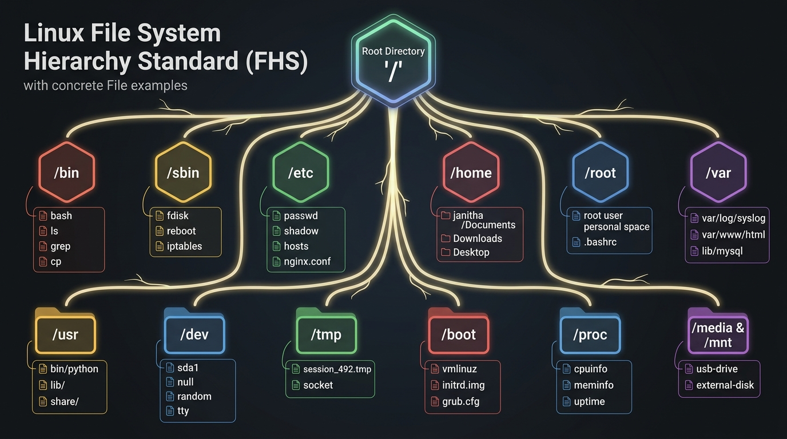

# 🐧 Linux File System Guide (සම්පූර්ණ මගපෙන්වීම)

මෙම ලේඛනය (Guide) මඟින් Linux File System එකේ මූලික සංකල්පවල සිට එහි අභ්‍යන්තර ව්‍යුහය (Hierarchy), ප්‍රධාන Folders, ඒවා තුළ ඇති සැබෑ Files පිළිබඳ ප්‍රායෝගික උදාහරණ (File Examples) සහ File Permissions දක්වා සරල සිංහලෙන් මෙන්ම තාක්ෂණික ගැඹුරින් (Deep Explanation) විස්තර කෙරේ.

> 🚀 **අලුත්ම පාඩම:** [Linux Boot Process (පියවරෙන් පියවර සරල මගපෙන්වීම)](./LINUX_BOOT_PROCESS.md) - පරිගණකය Power On කළ මොහොතේ සිට Desktop එක පැමිණෙන තෙක් සිදුවන පියවර 6 රූප සටහන් සහිතව මෙතැනින් කියවන්න.

---

## 1. මූලික සංකල්පය (Mindset Shift: Windows vs Linux)

| ලක්ෂණය | Windows | Linux |
| :--- | :--- | :--- |
| **ගබඩා ව්‍යුහය (Storage)** | Partitions සහ Drives පදනම් කරගත් ක්‍රමයකි (`C:\`, `D:\`, `E:\`). | තනි, උඩුයටිකුරු කළ ගසක් (Single Inverted Tree) වැනි ව්‍යුහයකි. |
| **ආරම්භක ලක්ෂ්‍යය** | ඒ ඒ Drive Letter එක (උදා: `C:\Users`). | **Root Directory** හෙවත් **`/`** (Forward Slash). |
| **ස්ලෑෂ් ලකුණ (Slash)** | Backslash (`\`) භාවිත වේ (උදා: `C:\Program Files`). | Forward slash (`/`) භාවිත වේ (උදා: `/usr/bin`). |
| **අමතර Disks / USB** | වෙනම අකුරක් ලැබේ (උදා: `E:\`, `F:\`). | පවතින ගසේ ෆෝල්ඩරයක් ඇතුළට **Mount** (සම්බන්ධ) වේ. |

---

## 2. "Everything is a File" (Linux හි මූලික දර්ශනය)

Linux පද්ධතියේ ඇති ප්‍රබලම සංකල්පය මෙයයි. Linux මෙහෙයුම් පද්ධතිය තුළ:
1. **Regular Files:** Text files, Images, Audio, PDF, Scripts ආදිය.
2. **Directories:** Folders පවා සලකන්නේ වෙනත් files ලැයිස්තුවක් අඩංගු විශේෂිත file එකක් ලෙසයි.
3. **Devices (Hardware):** Hard drives, USB, Keyboard, Mouse, Network Interfaces පවා `/dev` ෆෝල්ඩරය තුළ file එකක් ලෙස පවතී (උදා: `/dev/sda` යනු ප්‍රධාන hard drive එකයි).
4. **Kernel & Memory Data:** RAM එකේ තොරතුරු, CPU තොරතුරු, Running Processes පවා `/proc` ෆෝල්ඩරය තුළ file එකක් මෙන් කියවිය හැක (උදා: `/proc/cpuinfo`).

---

## 3. Linux File System Hierarchy (FHS) සමග සැබෑ Files උදාහරණ

Linux File System එක ආරම්භ වන්නේ මුදුනේ ඇති **Root (`/`)** මගිනි. අනෙක් සියලුම ෆෝල්ඩර් සහ උප-ගොනු (sub-files) අතු බෙදී යන්නේ එයින් පහළටයි.

### 🖼️ File System Hierarchy සහ එක් එක් Folder එකේ සැබෑ Files දැක්වෙන රූප සටහන:



> 💡 **රූපය පෙනෙන්නේ නැතිනම්:** IDE / VS Code එකේ ඉහළ දකුණු කෙළවරේ ඇති **"Open Preview"** icon එක ක්ලික් කරන්න (කෙටිමං යතුර: `Ctrl + Shift + V`). 
> නැතහොත් රූපය කෙලින්ම විවෘත කර බැලීමට [මෙතැන ක්ලික් කරන්න (Click to open image)](./linux_hierarchy_with_examples.jpg).

---

### 3.1. ගස් ව්‍යුහ සටහන සහ ප්‍රධාන Files (Interactive Directory Tree)

```mermaid
graph TD
    Root["/ (Root Directory)"]
    
    Root --> bin["📁 /bin (User Binaries)"]
    bin -.-> bin_f["📄 bash, ls, grep, cp, rm"]
    
    Root --> sbin["📁 /sbin (System Binaries)"]
    sbin -.-> sbin_f["📄 fdisk, reboot, iptables, ip"]
    
    Root --> etc["📁 /etc (Configurations)"]
    etc -.-> etc_f["📄 passwd, shadow, hosts, nginx.conf"]
    
    Root --> home["📁 /home (User Files)"]
    home -.-> home_f["📂 janitha/Documents, Downloads, Desktop"]
    
    Root --> root["📁 /root (Superuser Home)"]
    root -.-> root_f["📄 .bashrc, root personal space"]
    
    Root --> var["📁 /var (Variable Data)"]
    var -.-> var_f["📄 syslog, www/html, lib/mysql"]
    
    Root --> usr["📁 /usr (Installed Software)"]
    usr -.-> usr_f["📄 bin/python, lib/, share/"]
    
    Root --> dev["📁 /dev (Device Nodes)"]
    dev -.-> dev_f["📄 sda1, null, random, tty"]
    
    Root --> tmp["📁 /tmp (Temporary Files)"]
    tmp -.-> tmp_f["📄 session_492.tmp, socket"]
    
    Root --> boot["📁 /boot (Kernel & Bootloader)"]
    boot -.-> boot_f["📄 vmlinuz, initrd.img, grub.cfg"]
    
    Root --> proc["📁 /proc (Virtual Kernel Info)"]
    proc -.-> proc_f["📄 cpuinfo, meminfo, uptime"]
    
    Root --> media["📁 /media & /mnt (Mount Points)"]
    media -.-> media_f["📂 usb-drive, external-disk"]
    
    Root --> opt["📁 /opt (Optional 3rd-party Apps)"]
    opt -.-> opt_f["📂 google/chrome, discord"]
```



---

## 4. ප්‍රධාන Directories සහ ඒවායේ ඇති Files ගැඹුරින් තේරුම් ගැනීම

පහත දැක්වෙන්නේ එක් එක් ප්‍රධාන Folder එක, එහි කාර්යභාරය, සහ ඒ තුළ සැබවින්ම හමුවන ප්‍රධාන Files සහ Sub-folders පිළිබඳ සවිස්තරාත්මක විග්‍රහයකි.

---

### 📁 1. `/` (Root Directory)
* මුළු පද්ධතියේම මූලික ආරම්භක ලක්ෂ්‍යයයි.
* අනෙක් සියලුම files, folders සහ partitions සම්බන්ධ වන්නේ මෙයට යටිනි.
* Root permissions නොමැතිව මෙහි කෙලින්ම වෙනස්කම් කළ නොහැක.

---

### 📁 2. `/bin` (Essential User Binaries)
* සියලුම පරිශීලකයින්ට (All Users) run කළ හැකි මූලික Terminal Commands (Executables) මෙහි ඇත.
* Single-user mode වලදී පවා පද්ධතිය ක්‍රියාත්මක වීමට මේවා අත්‍යවශ්‍ය වේ.

#### 📄 මෙහි ඇති ප්‍රධාන Files උදාහරණ:
```text
/bin/
├── bash        # සාමාන්‍යයෙන් භාවිත වන Linux terminal shell එක
├── ls          # Folder එකක files ලැයිස්තුගත කරන command එක
├── cp          # File එකක් පිටපත් (copy) කරන binary එක
├── mv          # File එකක් වෙනත් තැනකට ගෙන යන හෝ rename කරන binary එක
├── rm          # File එකක් මකා දමන (delete) command එක
├── cat         # Text file එකක් terminal එකේ පෙන්වන command එක
└── grep        # Text එකක් තුළ වචන සෙවීමට ගන්නා command එක
```
> 🔍 **පරීක්ෂා කර බැලීමට Command එක:** `ls -lh /bin/bash /bin/ls /bin/cp`

---

### 📁 3. `/sbin` (System Binaries)
* System Administrator (`root`) ට පමණක් ධාවනය කළ හැකි, පද්ධතිය පාලනය කරන critical commands මෙහි ඇත.
* පද්ධතිය නඩත්තු කිරීම, boot වීම සහ recovery සඳහා අවශ්‍ය වේ.

#### 📄 මෙහි ඇති ප්‍රධාන Files උදාහරණ:
```text
/sbin/
├── fdisk       # Hard drive partitions සෑදීම සහ වෙනස් කිරීමේ tool එක
├── reboot      # පරිගණකය Restart කිරීමේ command එක
├── shutdown    # පරිගණකය සම්පූර්ණයෙන්ම ක්‍රියා විරහිත කිරීමේ command එක
├── iptables    # Linux firewall rules පාලනය කිරීම
└── ip          # Network interfaces සහ IP addresses පාලනය කරන command එක
```
> 🔍 **පරීක්ෂා කර බැලීමට Command එක:** `sudo ls -l /sbin/fdisk /sbin/reboot`

---

### 📁 4. `/etc` (Configuration Files)
* පද්ධතියේ සහ ඔබ install කරන software වල **සියලුම Settings / Configuration files** මෙහි අඩංගු වේ.
* Windows වල Registry එක වෙනුවට Linux වල ඇත්තේ මේ plain-text files වේ.

#### 📄 මෙහි ඇති ප්‍රධාන Files උදාහරණ:
```text
/etc/
├── passwd            # පද්ධතියේ ලියාපදිංචි සියලුම users ලාගේ ගිණුම් තොරතුරු
├── shadow            # Users ලාගේ Encrypted (Hash කළ) Passwords (root ට පමණක් කියවිය හැක)
├── group             # පරිශීලක කණ්ඩායම් (User groups) පිළිබඳ තොරතුරු
├── hosts             # Local DNS සහ IP ලිපින mappings (උදා: 127.0.0.1 localhost)
├── fstab             # Storage drives සහ partitions ස්වයංක්‍රීයව mount වන ආකාරය
├── resolv.conf       # අන්තර්ජාලය සඳහා භාවිත වන DNS Servers (උදා: 8.8.8.8)
└── nginx/
    └── nginx.conf    # Nginx Web Server එකේ ප්‍රධාන සැකසුම් ගොනුව
```
> 🔍 **පරීක්ෂා කර බැලීමට Command එක:** `cat /etc/hosts` හෝ `head -n 5 /etc/passwd`

---

### 📁 5. `/home` (User Personal Files)
* සාමාන්‍ය Users ලාගේ personal files (Desktop, Documents, Downloads, Music) තැන්පත් වන තැනයි.
* Windows හි `C:\Users\` ට සමාන වේ. Terminal කෙටි යෙදුම: `~`

#### 📄 මෙහි ඇති ප්‍රධාන Folders & Files උදාහරණ:
```text
/home/
└── janitha/                  # 'janitha' පරිශීලකයාගේ Home Directory එක
    ├── Desktop/              # Desktop එක මත ඇති ගොනු
    ├── Documents/            # ලිපි ලේඛන (උදා: project_report.pdf)
    ├── Downloads/            # Download කරන ලද ගොනු (උදා: installer.tar.gz)
    ├── .bashrc               # User ගේ Terminal settings සහ aliases (Hidden file)
    └── .ssh/
        ├── id_rsa            # User ගේ Private SSH Key එක
        └── id_rsa.pub        # User ගේ Public SSH Key එක
```
> 🔍 **පරීක්ෂා කර බැලීමට Command එක:** `ls -la ~`

---

### 📁 6. `/root` (Superuser Home Directory)
* පද්ධතියේ ප්‍රධාන පරිපාලකයා (Administrator / Superuser / `root`) ගේ personal home directory එකයි.
* සාමාන්‍ය users ලාගේ files `/home` තුළ තිබුණද, පද්ධතිය බිඳ වැටුණු අවස්ථාවකදී පවා partition එකක් නොවී root drive එකේදීම පරිපාලකයාට log වීමට `/root` වෙනම පවතී.

#### 📄 මෙහි ඇති ප්‍රධාන Files උදාහරණ:
```text
/root/
├── .bashrc           # Root පරිශීලකයාගේ විශේෂිත Terminal Profile එක
├── .bash_history     # Root විසින් terminal එකේ ක්‍රියාත්මක කළ commands ඉතිහාසය
└── server_backup.sh  # පරිපාලකයා විසින් සාදන ලද නඩත්තු scripts
```

---

### 📁 7. `/var` (Variable Data)
* පද්ධතිය ක්‍රියාත්මක වන විට **නිරන්තරයෙන් ප්‍රමාණය සහ අන්තර්ගතය වෙනස් වන දත්ත (Dynamic/Variable Data)** මෙහි තැන්පත් වේ.

#### 📄 මෙහි ඇති ප්‍රධාන Files සහ Folders උදාහරණ:
```text
/var/
├── log/
│   ├── syslog        # මුළු පද්ධතියේම සාමාන්‍ය logs සටහන්
│   ├── auth.log      # User login සහ authentication උත්සාහයන් (Security logs)
│   └── nginx/        # Nginx වෙබ් සේවාදායකයේ access.log සහ error.log
├── www/
│   └── html/
│       └── index.html # Apache හෝ Nginx මඟින් සත්කාරකත්වය සපයන වෙබ් අඩවි files
└── lib/
    ├── mysql/        # MySQL / MariaDB දත්ත සමුදායේ (Database) raw data files
    └── docker/       # Docker Containers, Images සහ Volumes ගබඩා වන තැන
```
> 🔍 **පරීක්ෂා කර බැලීමට Command එක:** `sudo tail -n 20 /var/log/syslog`

---

### 📁 8. `/usr` (User System Resources)
* සාමාන්‍යයෙන් System එකට අමතරව install වන පරිශීලක මෘදුකාංග (User Applications, Libraries, Documentation) මෙහි තැන්පත් වේ.

#### 📄 මෙහි ඇති ප්‍රධාන Folders සහ Files උදාහරණ:
```text
/usr/
├── bin/              # පරිශීලකයා install කරන non-critical commands (උදා: python3, git, curl, node)
├── lib/              # මෘදුකාංග වලට අවශ්‍ය Shared libraries (Windows හි .dll වැනි .so files)
│   └── libc.so.6     # Standard C runtime library
├── local/            # Source code එකෙන් build කර install කරන local software
│   └── bin/          # Local custom binaries
└── share/
    └── doc/          # මෘදුකාංග වල documentation සහ manuals (man pages)
```
> 🔍 **පරීක්ෂා කර බැලීමට Command එක:** `which python3` හෝ `ls /usr/bin/git`

---

### 📁 9. `/dev` (Device Files)
* පරිගණකයේ ඇති සියලුම Hardware උපාංග (Disks, Terminals, USB) Linux විසින් හසුරුවන්නේ files විදිහටයි.

#### 📄 මෙහි ඇති ප්‍රධාන Files උදාහරණ:
```text
/dev/
├── sda         # පළමු Physical SATA/SCSI Hard Disk එක
├── sda1        # පළමු Hard Disk එකේ 1 වන Partition එක
├── nvme0n1     # NVMe High-speed SSD ධාවකය
├── null        # "Black hole" එකක් වැනි විශේෂ file එකක්. මෙයට යවන දත්ත විනාශ වේ (Discard)
├── zero        # කියවීමේදී අසීමිතව zeros (0) සපයන විශේෂ file එකක්
├── random      # Cryptographic security සඳහා අහඹු දත්ත (Random numbers) සපයන file එකක්
└── tty1        # පළමු Virtual Terminal Console තිරය
```
> 🔍 **පරීක්ෂා කර බැලීමට Command එක:** `ls -l /dev/sd*` හෝ `ls -l /dev/null`

---

### 📁 10. `/tmp` (Temporary Files)
* Applications සහ OS එක මඟින් තාවකාලිකව අවශ්‍ය වන files මෙහි තැන්පත් කරයි.
* බොහෝ Linux distributions වල System එක Restart (Reboot) වන විට මෙහි ඇති දත්ත ස්වයංක්‍රීයව මැකී යයි.

#### 📄 මෙහි ඇති ප්‍රධාන Files උදාහරණ:
```text
/tmp/
├── sess_9a8f2e71     # වෙබ් අඩවියක තාවකාලික user session ගොනුවක්
├── npm-4912-cache    # Node Package Manager හි තාවකාලික build files
└── ssh-agent.sock    # SSH authentication සඳහා තාවකාලික Unix socket file එකක්
```

---

### 📁 11. `/proc` සහ `/sys` (Virtual Filesystems)
* මේවා Hard Disk එකේ සැබවින්ම save වී ඇති files නොවේ!
* පරිගණකය ක්‍රියාත්මක වන විට **RAM එක තුළ dynamically හැදෙන Virtual Filesystems** වේ.

#### 📄 මෙහි ඇති ප්‍රධාන Files උදාහරණ:
```text
/proc/
├── cpuinfo     # පරිගණකයේ ප්‍රොසෙසරය (CPU cores, speed, model) පිළිබඳ තොරතුරු
├── meminfo     # RAM පරිභෝජනය, Free memory, Buffers සහ Cache විස්තර
├── uptime      # පරිගණකය On කර කොපමණ වේලාවක් ගතවී ඇත්දැයි තත්පර වලින්
├── version     # ධාවනය වන Linux Kernel එකේ සංස්කරණ තොරතුරු
└── 1/          # Process ID 1 (init / systemd) පිළිබඳ තොරතුරු (දැනට run වන සියලුම processes සඳහා මෙවැනි අංකිත folders ඇත)
```
> 🔍 **පරීක්ෂා කර බැලීමට Command එක:** `cat /proc/cpuinfo | grep "model name"` හෝ `cat /proc/meminfo`

---

### 📁 12. `/boot` (Boot Loader Files)
* පරිගණකය Turn-on (Boot) වීමට අවශ්‍ය critical files මෙහි ඇත.

#### 📄 මෙහි ඇති ප්‍රධාන Files උදාහරණ:
```text
/boot/
├── vmlinuz-6.5.0-generic   # සම්පීඩිත (Compressed) Linux Kernel binary එක
├── initrd.img-6.5.0        # Hard disk එක කියවීමට පෙර Kernel එක RAM එකට load කරගන්නා initial driver disk එක
└── grub/
    └── grub.cfg            # පරිගණකය On වන විට පෙනෙන OS තේරීමේ මෙනුව (GRUB boot menu)
```
> 🔍 **පරීක්ෂා කර බැලීමට Command එක:** `ls -lh /boot`

---

### 📁 13. `/opt` (Optional 3rd-party Software)
* තනි package එකක් ලෙස, dependencies සියල්ල එකම folder එකක තබා ගන්නා 3rd-party commercial හෝ standalone software මෙහි install වේ.

#### 📄 මෙහි ඇති ප්‍රධාන Folders සහ Files උදාහරණ:
```text
/opt/
├── google/
│   └── chrome/
│       └── google-chrome   # Google Chrome browser එකේ binary සහ resource files
└── discord/
    └── Discord             # Discord desktop chat app එක
```

---

### 📁 14. `/media` සහ `/mnt` (Mount Points)
* **`/media`**: USB Flash drives, External Hard disks, CD/DVD plug කළ විට OS එක විසින් ස්වයංක්‍රීයව (automatically) mount කරන තැන.
* **`/mnt`**: System Administrator විසින් manually temporary filesystem එකක් (උදා: Network share, NFS drive) mount කරගන්නා තැන.

#### 📄 මෙහි ඇති ප්‍රධාන Folders උදාහරණ:
```text
/media/janitha/KINGSTON_USB/    # පරිශීලකයා සම්බන්ධ කළ USB පෙන්ඩ්‍රයිව් එක
/mnt/backup_server/             # Administrator විසින් සම්බන්ධ කළ Network Shared Folder එක
```

---

## 5. File Permissions & Ownership (RWX ගැඹුරින්)

Linux වල සෑම file එකකටම සහ folder එකකටම ආරක්ෂාව සඳහා **Permissions** සහ **Owner** කෙනෙකු සිටී.

Terminal එකේ `ls -l` command එක ලබා දුන් විට මෙසේ දිස්වේ:
```text
-rwxr-xr--  1  janitha  developers  4096  Sep 30 20:30  script.sh
```

### කොටස් විශ්ලේෂණය:
1. **File Type (1 වන අකුර):**
   * `-` : Regular file එකක්
   * `d` : Directory (Folder) එකක්
   * `l` : Symbolic Link (Shortcut) එකක්
2. **Permissions (ඉතිරි අකුරු 9):**
   * `r` = Read (කියවීමට)
   * `w` = Write (වෙනස් කිරීමට / මැකීමට)
   * `x` = Execute (Run කිරීමට - script/binary)

```text
    ┌─── File Type (- = file, d = directory)
    │
    │  ┌── User (Owner) Permissions: rwx (Read, Write, Execute)
    │  │   ┌── Group Permissions: r-x (Read, Execute)
    │  │   │   ┌── Others (World) Permissions: r-- (Read only)
    │  │   │   │
    - rwx r-x r--
```

### අංක ක්‍රමය (Octal Representation):
* `r = 4`, `w = 2`, `x = 1`
* `chmod 755 script.sh`
  * Owner: `4 + 2 + 1 = 7` (rwx)
  * Group: `4 + 0 + 1 = 5` (r-x)
  * Others: `4 + 0 + 1 = 5` (r-x)

---

## 6. Paths (මග) තේරුම් ගැනීම

* **Absolute Path (නිරපේක්ෂ මග):**
  * සැමවිටම root (`/`) එකෙන් ආරම්භ වේ.
  * උදාහරණ: `/home/janitha/projects/app.js`
* **Relative Path (සාපේක්ෂ මග):**
  * ඔබ දැනට සිටින තැන (Current Working Directory) පාදක කරගනී.
  * `.` = Current Directory
  * `..` = Parent Directory (පෙර ෆෝල්ඩරය)
  * උදාහරණ: `./app.js` හෝ `../config/db.json`

---

## 7. මූලික Linux Commands Cheat Sheet

```bash
# 1. Navigation (ෆෝල්ඩර් අතර ගමන් කිරීම)
pwd                      # දැනට සිටින සම්පූර්ණ path එක පෙන්වයි (Print Working Directory)
cd /home/janitha         # Absolute path එකට යෑම
cd ..                    # එක් පියවරක් පසුපසට යෑම
cd ~                     # Home directory එකට යෑම

# 2. Listing & Viewing (දත්ත බැලීම)
ls -la                   # සැඟවුණු (hidden) files සහ permissions සමග ලැයිස්තුගත කිරීම
cat /etc/hosts           # Text file එකක් terminal එකේ කියවීම
head -n 20 file.txt      # File එකක මුල් පේළි 20 බැලීම
tail -f /var/log/syslog  # Real-time logs බලාගැනීම

# 3. File Operations (Files හැසිරවීම)
mkdir new_folder         # අලුත් folder එකක් සෑදීම
touch file.txt           # අලුත් හිස් file එකක් සෑදීම
cp file.txt /tmp/        # File එකක් copy කිරීම
mv file.txt /home/       # File එකක් move කිරීම හෝ rename කිරීම
rm -rf folder_name       # Folder එකක් සහ එහි සියලුම දේ මැකීම (ප්‍රවේශමෙන් භාවිත කරන්න!)

# 4. System Information (පද්ධති විස්තර)
df -h                    # Hard disk space භාවිතය බැලීම (Disk Free)
du -sh *                 # Current folder එකේ ඇති files වල ප්‍රමාණය බැලීම
cat /proc/meminfo        # RAM පරිභෝජන විස්තර බැලීම
cat /proc/cpuinfo        # CPU විස්තර බැලීම
```
